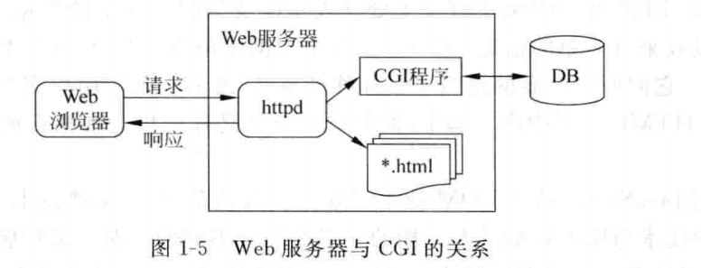
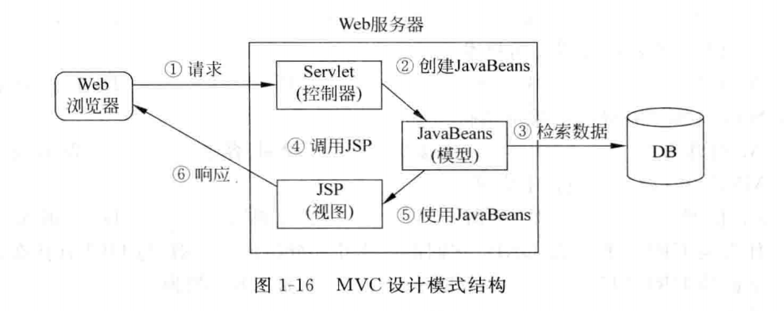

### CH1 概述

#### 1.1.3Web体系结构

主要由三部分构成：

​	(1)**Web服务器**。用户要访问Web页面或其他资源，必须事先有一个服务器来提供Web页面和这些资源，这种服务器就是Web服务器。

​	(2)**Web客户端**。用户一般是通过浏览器访问Web资源的，它是运行在客户端的一种软件。

​	(3)**通信协议**。客户端和服务器之间采用HTTP进行通信。HTTP是浏览器和Web服务器通信的基础，是应用层协议。

#### 1.2.1 HTTP

​		超文本传输协议(Hypertext Transfer Protocol,HTTP)是Web使用的协议。该协议详细规定了Web客户与服务器之间如何通信。它是一个基于请求-响应(request-response)的无状态协议。

E.g

> 例如，在浏览器的地址栏中输入“http://www.tsinghua.edu.cn/”,按下回车键
>
> - 浏览器就会创建一个HTTP请求消息，
> - 使用**DNS**获得www.tsinghua.edu.cn主机的IP地址，
> - 创建一条**TCP连接**，通过这条TCP连接将HTTP消息发送给服务器，
> - 并从服务器接收回一条消息，该消息中包含将显示在浏览器客户区中的消息。

#### 1.2.2URL

1.URL

​		URL(Uniform Resource Locator)称为统一资源定位器，指向Internet上位于某个位置的某个资源。资源包括HTML文件、图像文件和Servlet等。例如，下面是一些合法的URL。

http://www.baidu.com/index.html

http://www.mydomain.com/fiIes/sales/report.html

http://localhost:8080/helloweb/

> URL通常由4部分组成：-
>
> - 协议名称、
> - 所在主机的DNS名、
> - 可选的端口号和资源的名称。
> - 端口号和资源名称可以省略。

#### 2.URI

​		URI(Uniform Resource Identifier)称为统一资源标识符，是以特定语法标识一个资源的字符串。URI由模式和模式特有的部分组成，它们之间用冒号隔开，一般格式如下：

#### 1.2.3XML & HTML

**XML**(eXtensible Markup Language)称为可扩展标记语言，是W3C于1998年推出的一种用于数据描述的元标记语言的国际标准。相对于HTML,XML具有如下的一些特点：

(1)可扩展性。XML不是标记语言，它本身并不包含任何标记。它允许用户自己定义标记和属性，可以有各种定制的数据格式。

(2)更多的结构和语义。XML侧重于对文档内容的描述，而不是文档的显示。

#### 1.3.3  服务器端动态Web文档技术

目前，在服务器端动态生成Web页面有多种方法。

##### 1.CGI技术

==公共网关接口==(Common Gateway Interface,CGI)技术是在服务器端生成动态Web文档的传统方法。CGI是一种标准化的接口，允许Web服务器与后台程序和脚本通信，这些后台程序和脚本能够接受输入信息(例如，来自表单),访问数据库，最后生成HTML页面作为响应。CGI与Web服务器和应用程序的关系如图1-5所示。

##### 2.服务器扩展技术

​		一个更好的方法是**使服务器支持单独的可执行模块**，当服务器启动时该模块就装入内存并只初始化一次。然后，就可以通过已经驻留在内存的、准备提供服务的模块副本为每个请求提供服务。有幸的是，大多数产品级的服务器已经早就支持这种模块，这些独立的可执行的模块称为服务器扩展。在非Java平台上，服务器扩展是通过服务器销售商提供的本地语言API编写的。在Java平台上，服务器扩展是使用Servlet API编写的，**服务器扩展模块叫做Servlet容器**。

##### **3.在HTML页面中嵌入脚本技术**

ASP.NET， PHP 和 JSP

#### MVC模式

在这种结构中，将Web组件分为模型(Model)、视图(View)和控制器(Controller),每种组件完成各自的任务。在这种结构中所有请求的目标都是Servlet或Filter,它充当应用程序的控制器。Servlet分析请求并将响应所需要的数据收集到JavaBeans对象或POJO对象中，该对象作为应用程序的模型。最后，Servlet控制器将请求转发到JSP页面。这些页面使用存储在JavaBeans中的数据产生响应。JSP页面构成了应用程序的视图。

### CH2 Servlet技术模型

#### 2.3.2  发送HTTP请求

在客户端如果发生下面的事件，浏览器就向Web服务器发送一个HTTP请求。

(1)用户在浏览器的地址栏中输入URL并按回车键。

(2)用户单击了HTML页面中的超链接。

(3)用户在HTML页面中添写一个表单并提交。

在上面的三种方法中，前两种方法向Web服务器发送的都是GET请求。如果使用HTML表单发送请求可以通过method属性指定使用GET请求或POST请求。

**==默认情况下使用表单发送的请求也是GET请求，如果发送POST请求，需要将method属性值指定为“post”。==**

##### 请求对象vs会话对象

> 1. **存储的信息**：
>
>    - **请求对象（HttpServletRequest）**：存储有关特定HTTP请求的信息，如请求参数、请求头和其他与请求相关的数据。
>    - **会话对象（HttpSession）**：用于在不同的HTTP请求之间存储用户特定的信息，以实现会话状态的保持。这包括用户的登录状态、购物车内容等。
>
> 2. **生命周期**：
>
>    - **请求对象（HttpServletRequest）**：每个HTTP请求都会创建一个新的HttpServletRequest对象，该对象在请求处理完成后被销毁。
>    - **会话对象（HttpSession）**：会话对象的生命周期由会话的开始和结束决定。会话可以在用户第一次访问应用时创建，并在用户会话过期、用户注销或会话被显式地终止时销毁。
>
> 3. **使用场景**：
>
>    - **请求对象（HttpServletRequest）**：主要用于处理单个HTTP请求的信息，例如从表单中获取参数、处理上传文件等。
>    - **会话对象（HttpSession）**：主要用于在整个用户会话期间跟踪和存储用户的状态信息，例如用户登录状态、购物车内容等。
>
> 4. **作用范围（Scope）**：
>
>    - **请求对象（HttpServletRequest）**： 
>
>      ​		作用范围限定在==单个HTTP请求和响应周期内==。它包含与客户端发起的特定请求相关的信息，如请求参数、请求头、请求方法等。当客户端发送新请求时，==每个请求都有自己的HttpServletRequest对象==。
>
>    - **会话对象（HttpSession）**：
>
>      ​	 作用范围==跨足多个HTTP请求和响应周期==，通常通过在客户端和服务器之间传递唯一的会话标识（通常是一个Cookie或URL重写）来实现。==会话对象用于在用户访问应用的多个页面之间共享信息==。
>
> 简而言之，请求对象是短暂且与单个请求相关的，而会话对象是用于在多个请求之间保持状态信息的更长时间的对象。

|                | 请求对象HttpServletRequest                                   | 会话对象HttpSession                                          |
| -------------- | ------------------------------------------------------------ | ------------------------------------------------------------ |
| **作用范围**   | 单个HTTP请求和响应周期内                                     | 跨足多个HTTP请求和响应周期                                   |
| **存储的信息** | 有关特定HTTP请求的信息,如请求参数、请求头和其他与请求相关的数据 | 用于在不同的HTTP请求之间存储用户特定的信息，以实现会话状态的保持 |
| **生命周期**   | 每个HTTP请求都会创建一个新的HttpServletRequest对象，该对象在请求处理完成后被销毁。 | 由会话的开始和结束决定。会话可以在用户第一次访问应用时创建，并在用户会话过期、用户注销或会话被显式地终止时销毁。 |
| **使用场景**   | 主要用于处理单个HTTP请求的信息，例如从表单中获取参数、处理上传文件等 | 主要用于在整个用户会话期间跟踪和存储用户的状态信息，例如用户登录状态、购物车内容等 |

