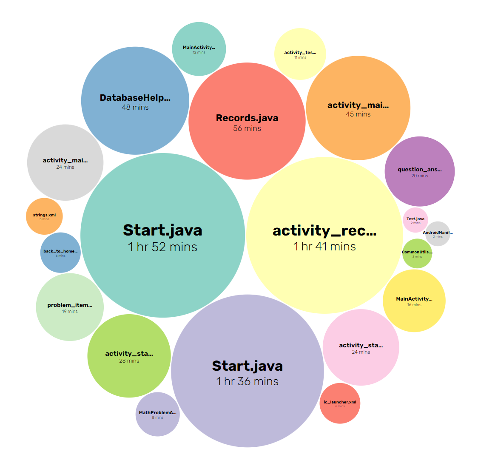

（掌握虚拟机api
### 9.21

- [x] #todo Android调试，能在虚拟机上面输出Hello World
- [ ] #todo 配置OpenGLRenderer

这个算运行成功嘛AWA(跑了五分钟啊，感觉电脑cpu要炸了)

![[Pasted image 20230921142950.png]]


原始xml
```xml
<?xml version="1.0" encoding="utf-8"?>  
<androidx.constraintlayout.widget.ConstraintLayout xmlns:android="http://schemas.android.com/apk/res/android"  
    xmlns:app="http://schemas.android.com/apk/res-auto"  
    xmlns:tools="http://schemas.android.com/tools"  
    android:layout_width="match_parent"  
    android:layout_height="match_parent"  
    tools:context=".MainActivity">  
  
    <TextView  
        android:id="@+id/textView2"  
        android:layout_width="wrap_content"  
        android:layout_height="wrap_content"  
        android:text="@string/hello_world_nhello_cecilia"  
        app:layout_constraintBottom_toBottomOf="parent"  
        app:layout_constraintEnd_toEndOf="parent"  
        app:layout_constraintStart_toStartOf="parent"  
        app:layout_constraintTop_toTopOf="parent"  
        app:layout_constraintVertical_bias="0.393" />  
    </androidx.constraintlayout.widget.ConstraintLayout>
```

书上代码1
```xml
<?xml version="1.0" encoding="utf-8"?>  
<LinearLayout xmlns:android="http://schemas.android.com/apk/res/android"  
  
    xmlns:tools="http://schemas.android.com/tools"  
    android:layout_width="match_parent"  
    android:layout_height="match_parent"  
    android:layout_gravity="center"  
    android:orientation="vertical">  
  
    <TextView  
  
        android:layout_width="wrap_content"  
        android:layout_height="wrap_content"  
        android:layout_padding="24dp"  
        android:text="question_text" />  
  
    <LinearLayout  
        android:layout_width="wrap_content"  
        android:layout_height="wrap_content"  
        android:orientation="horizontal">  
  
        <Button  
            android:layout_width="wrap_content"  
            android:layout_height="wrap_content"  
            android:text="True"/>  
  
        <Button  
            android:layout_width="wrap_content"  
            android:layout_height="wrap_content"  
            android:text="@string/false" />  
  
    </LinearLayout>  
  
  
</LinearLayout>
```


#坑 为什么更新了xml文件之后，重新运行虚拟机上的安卓程序没有相应更新

- [解决xml中修改内容，运行在手机上没效果问题](https://www.jianshu.com/p/333177de2e5b)

> 当我们在xml修改一些东西后，运行在手机上可能没效果没效果。一般的原因就是build里面缓存导致。
>  解决方案：
>  1.**需要clean Project 再Rebuild Project后，运行在手机上才能生效。**
>  2.如果在**gradle.properties**里面配置了*android.buildCacheDir=./build/buildCache/* ，把他删除掉，在清理项目，就可以。
>  如图：
>
> 
>
> 


- 删除了mainactivity.kt，新建了相应的java文件

  备份：

  ```kotlin
  package com.example.myapplication
  
  import androidx.appcompat.app.AppCompatActivity
  import android.os.Bundle
  import android.widget.Button
  import android.content.Intent;
  import android.view.View;
  
  
  class MainActivity : AppCompatActivity() {
  
      // Declare a variable for the button
      private lateinit var mbtLogin: Button;
  
      override fun onCreate(savedInstanceState: Bundle?) {
          super.onCreate(savedInstanceState)
          setContentView(R.layout.activity_main)
  
          //1. Find the button by its id
          mbtLogin = findViewById(R.id.button_login);
          // 2. Set a click listener on the button
  
      }
  
  
  }
  ```

  

### 10.8

- [kotlin和java相互转换的实操](https://blog.csdn.net/weixin_43202123/article/details/125747448?ops_request_misc=&request_id=&biz_id=102&utm_term=android%20studio%E6%80%8E%E4%B9%88%E6%8A%8Akotlin%E8%BD%AC%E6%8D%A2%E4%B8%BAjava&utm_medium=distribute.pc_search_result.none-task-blog-2~all~sobaiduweb~default-0-125747448.142^v95^chatgptT3_1&spm=1018.2226.3001.4187)

  > 其实就是互转，下面用Android studio 示范
  >
  > Kotlin 转换Java文件
  >
  >     Tools>Kotlin>Show Kotlin Bytecode
  >     Decompile
  >
  > Java转换kotlin文件（需要studio3.0）或者安装了kotlin插件。
  >
  > 选择页面的要转的文件
  >
  > 第一种   Ctrl+Shift+Alt+K
  >
  > 第二种    Code - Convert Java File To Kotlin File 
  >  


### 10.9

!解决编译慢的问题了！！（就是梯子太卡了awa,换梯子之后只编译了2s……无语啦


课堂任务

> 理解您的需求，下面是一个完整的示例，包含每一步的具体代码以创建一个Android应用程序，其中一个Activity显示日历，点击日期后将日期数据传递到另一个Activity中。在这个示例中，我们将使用 "Material Calendar View" 库来实现日期选择。
>
> 1. **创建新项目**：
>
>    在Android Studio中创建一个新的Android项目。
>
> 2. **添加依赖库**：
>
>    打开项目级别的build.gradle文件，并确保已添加以下依赖库：
>
>    ```gradle
>    implementation 'com.applandeo:material-calendar-view:1.7.0'
>    ```
>
> 3. **设计第一个Activity的布局**：
>
>    在 `activity_main.xml` 布局文件中，添加一个按钮，用户可以点击它来打开日历选择日期。
>
>    ```xml
>    <?xml version="1.0" encoding="utf-8"?>
>    <LinearLayout
>        xmlns:android="http://schemas.android.com/apk/res/android"
>        xmlns:app="http://schemas.android.com/apk/res-auto"
>        xmlns:tools="http://schemas.android.com/tools"
>        android:layout_width="match_parent"
>        android:layout_height="match_parent"
>        android:orientation="vertical"
>        android:gravity="center"
>        android:padding="16dp"
>        tools:context=".MainActivity">
>
>        <Button
>            android:id="@+id/button_open_calendar"
>            android:layout_width="wrap_content"
>            android:layout_height="wrap_content"
>            android:text="Open Calendar"
>            android:textSize="18sp" />
>
>    </LinearLayout>
>    ```
>
> 4. **设计第二个Activity的布局**：
>
>    在 `activity_second.xml` 布局文件中，添加一个用于显示日期的TextView。
>
>    ```xml
>    <?xml version="1.0" encoding="utf-8"?>
>    <LinearLayout
>        xmlns:android="http://schemas.android.com/apk/res/android"
>        xmlns:app="http://schemas.android.com/apk/res-auto"
>        xmlns:tools="http://schemas.android.com/tools"
>        android:layout_width="match_parent"
>        android:layout_height="match_parent"
>        android:orientation="vertical"
>        android:gravity="center"
>        android:padding="16dp"
>        tools:context=".SecondActivity">
>
>        <TextView
>            android:id="@+id/textView"
>            android:layout_width="wrap_content"
>            android:layout_height="wrap_content"
>            android:text="Selected Date: "
>            android:textSize="18sp" />
>
>    </LinearLayout>
>    ```
>
> 5. **实现日期选择逻辑**：
>
>    在第一个Activity的Java文件中，为按钮添加点击事件，以打开日期选择器。
>
>    ```java
>    import android.content.Intent;
>    import android.os.Bundle;
>    import android.view.View;
>    import androidx.appcompat.app.AppCompatActivity;
>    import com.applandeo.materialcalendarview.CalendarView;
>    import com.applandeo.materialcalendarview.EventDay;
>    import com.applandeo.materialcalendarview.listeners.OnDayClickListener;
>    
>    import java.util.Calendar;
>    import java.util.List;
>    
>    public class MainActivity extends AppCompatActivity {
>    
>        @Override
>        protected void onCreate(Bundle savedInstanceState) {
>            super.onCreate(savedInstanceState);
>            setContentView(R.layout.activity_main);
>    
>            Button buttonOpenCalendar = findViewById(R.id.button_open_calendar);
>    
>            buttonOpenCalendar.setOnClickListener(new View.OnClickListener() {
>                @Override
>                public void onClick(View v) {
>                    // 打开日历选择日期
>                    Intent intent = new Intent(MainActivity.this, CalendarActivity.class);
>                    startActivityForResult(intent, 1);
>                }
>            });
>        }
>    }
>    ```
>
> 6. **创建第三个Activity，用于显示日历**：
>
>    在Android Studio中，创建一个新的Activity，可以按照以下步骤操作：
>
>    - 在项目资源管理器中，右键单击 "app" 模块。
>    - 选择 "New"（新建） > "Activity" > "Empty Activity"（空白Activity）。
>    - 为该Activity指定一个名称，例如 "CalendarActivity"。
>
> 7. **在CalendarActivity中实现日历选择**：
>
>    打开 `CalendarActivity.java` 文件，并添加以下代码：
>
>    ```java
>    import android.content.Intent;
>    import android.os.Bundle;
>    import androidx.annotation.NonNull;
>    import androidx.appcompat.app.AppCompatActivity;
>    import com.applandeo.materialcalendarview.CalendarView;
>    import com.applandeo.materialcalendarview.EventDay;
>    import com.applandeo.materialcalendarview.listeners.OnDayClickListener;
>    import java.text.SimpleDateFormat;
>    import java.util.ArrayList;
>    import java.util.Calendar;
>    import java.util.List;
>    
>    public class CalendarActivity extends AppCompatActivity {
>    
>        private CalendarView calendarView;
>    
>        @Override
>        protected void onCreate(Bundle savedInstanceState) {
>            super.onCreate(savedInstanceState);
>            setContentView(R.layout.activity_calendar);
>    
>            calendarView = findViewById(R.id.calendarView);
>    
>            // 设置日历视图的点击事件监听器
>            calendarView.setOnDayClickListener(new OnDayClickListener() {
>                @Override
>                public void onDayClick(EventDay eventDay) {
>                    Calendar clickedDayCalendar = eventDay.getCalendar();
>                    SimpleDateFormat dateFormat = new SimpleDateFormat("yyyy-MM-dd");
>                    String selectedDate = dateFormat.format(clickedDayCalendar.getTime());
>    
>                    // 将所选日期返回到MainActivity
>                    Intent resultIntent = new Intent();
>                    resultIntent.putExtra("selectedDate", selectedDate);
>                    setResult(RESULT_OK, resultIntent);
>                    finish();
>                }
>            });
>        }
>    }
>    ```
>
> 8. **在 `AndroidManifest.xml` 中声明CalendarActivity**：
>
>    确保在 `AndroidManifest.xml` 中声明 `CalendarActivity`：
>
>    ```xml
>    <activity android:name=".CalendarActivity" />
>    ```
>
> 9. **处理日期选择结果**：
>
>    在第一个Activity中，处理从CalendarActivity返回的所选日期：
>
>    ```java
>    @Override
>    protected void onActivityResult(int requestCode, int resultCode, Intent data) {
>        super.onActivityResult(requestCode, resultCode, data);
>           if (requestCode == 1 && resultCode == RESULT_OK) {
>           if (data != null && data.hasExtra("selectedDate")) {
>               String selectedDate = data.getStringExtra("selectedDate");
>                               
>               // 更新UI以显示所选日期
>               TextView textView = findViewById(R.id.textView);
>               textView.setText("Selected Date: " + selectedDate);
>           }
>       }
>    }
>
> 
>
> 这样，您就可以在第一个Activity中选择日期，将其传递到CalendarActivity进行选择，然后返回所选日期并在第一个Activity中显示它。确保您的布局文件和代码与上述示例匹配，并根据需要进行适当的自定义。


### *10.16*

- [x] 将安卓手机与Android Studio连接

#坑 Android Studio 真机调试每次都需要安装

==KEY== : 开发者模式—USB调试----监控ADB安装应用-----关闭即可解决。


gpt_eg1:

>  请注意，之前的回答中已经为大多数代码提供了注释，在这里提供了剩下的代码的基本注释：
>
> ```java
> public class MainActivity extends AppCompatActivity {
>     private DatabaseHelper dbHelper;  // 声明了一个 DatabaseHelper 对象，用于管理数据库的创建和更新
>     private SQLiteDatabase database;  // 声明了一个 SQLiteDatabase 对象，用于执行数据库操作
>     private TextView questionTextView;  // 声明了一个 TextView 对象，用于显示问题
>     private EditText answerEditText;  // 声明了一个 EditText 对象，用于接收答案输入
>     private TextView resultTextView;  // 声明了一个 TextView 对象，用于显示答案结果
> 
>     @Override
>     protected void onCreate(Bundle savedInstanceState) {  // 活动创建时调用的方法
>         super.onCreate(savedInstanceState);
>         setContentView(R.layout.activity_main);  // 设置活动使用的布局文件
> 
>         dbHelper = new DatabaseHelper(this);  // 创建 DatabaseHelper 实例，以便访问数据库
>         database = dbHelper.getReadableDatabase();  // 获取可读数据库对象
> 
>         questionTextView = findViewById(R.id.questionTextView);  // 初始化 questionTextView 对象
>         answerEditText = findViewById(R.id.answerEditText);  // 初始化 answerEditText 对象
>         resultTextView = findViewById(R.id.resultTextView);  // 初始化 resultTextView 对象
> 
>         loadRandomMathProblem();  // 载入随机的数学问题
>     }
> 
>     public void checkAnswer(View view) {  // 点击按钮后执行的方法
>         String userAnswer = answerEditText.getText().toString();  // 获取用户输入的答案
>         String correctAnswer = getCorrectAnswer();  // 获取正确答案
> 
>         if (userAnswer.equals(correctAnswer)) {  // 比较用户答案和正确答案
>             resultTextView.setText("Correct!");  // 若答案正确，显示 "Correct!"
>         } else {
>             resultTextView.setText("Incorrect. Try again.");  // 若答案错误，显示 "Incorrect. Try again."
>         }
> 
>         answerEditText.getText().clear();  // 清空答案输入框的内容
>         loadRandomMathProblem();  // 载入下一个随机的数学问题
>     }
> 
>     private void loadRandomMathProblem() {  // 加载随机的数学问题
>         String[] columns = {DatabaseHelper.COL_QUESTION};  // 指定要检索的列
>         Cursor cursor = database.query(
>             DatabaseHelper.TABLE_NAME, columns, null, null, null, 
>             null, "RANDOM()", "1"  // 指定 SQL 查询的选择条件和排序规则
>         );
> 
>         if (cursor != null && cursor.moveToFirst()) {  // 检查 cursor 是否有效，并将其移到第一行
>             String question = cursor.getString(cursor.getColumnIndex(DatabaseHelper.COL_QUESTION));  // 提取问题列的值
>             questionTextView.setText(question);  // 将问题文本显示在界面上
>         }
>         if (cursor != null) {
>             cursor.close();  // 关闭 cursor
>         }
>     }
> 
>     private String getCorrectAnswer() {  // 获取正确答案
>         String[] columns = {DatabaseHelper.COL_ANSWER};  // 指定要检索的列
>         Cursor cursor = database.query(
>             DatabaseHelper.TABLE_NAME, columns, null, null, null, 
>             null, null, "1"  // 指定 SQL 查询的选择条件和排序规则
>         );
> 
>         if (cursor != null && cursor.moveToFirst()) {
>             return String.valueOf(cursor.getInt(cursor.getColumnIndex(DatabaseHelper.COL_ANSWER)));  // 获取正确答案
>         }
>         if (cursor != null) {
>             cursor.close();
>         }
>         return "";
>     }
> 
>     @Override
>     protected void onDestroy() {  // 活动销毁时调用的方法
>         super.onDestroy();
>         if (database != null) {
>             database.close();  // 关闭数据库连接
>         }
>     }
> }
> ```
>
> 这些注释描述了每个方法的功能和目的，并对每个成员变量的用途进行了解释。
>
> 希望这可以回答您的问题。如果您有其他问题，请随时提问。

#坑 数据库文件未升级

> - KEY1：
>   - ==**直接从设备上删除应用**==是删除数据库文件最便捷的方法。要在模拟器上删除应用，可以切换 到应用浏览器界面，向上拖动CriminalIntent应用的图标，直到屏幕顶部出现Uninstall字样


### *10.17*

#坑 处理重复布局的代码

==KEY==:

>   1.使用标签
>   2.使用 RecyclerView

- [ ] #todo 优化界面设计
- [ ] #todo 输入限制（只能是数字）
- [ ] #todo test 功能里面，提交之后，显示所有对错/答案
- [x]  增加记录错题的功能
  - [x] 修改添加错题逻辑（现在每次记录只有用户答案改变了）
  - [x] 修改错题页面


打包apk(阿西，打包之前应该跑一次的……忘记注释与test相关的代码了)

密码都是153153


10h（好难过啊，交作业忘记贴代码了）



### 10.24

请自主DIY一款APP以实现或部分实现：

1.调用照相机功能；；；

2.将新拍摄照片保存至sqlLite数据库中，包含拍摄点的时间（精确到秒）及经度和纬度值；

3.浏览数据库中图片（亦可约定显示近一天或一周来新入库图片）。


 

> 要实现这个 DIY APP 的过程，你可以按照以下步骤进行操作：
>
> 1.调用照相机功能：
>
> - 在布局文件中创建一个按钮或图标用于触发拍照操作。例如，你可以使用一个 `ImageView` 图标作为拍照按钮。
> - 在按钮的点击监听器中，使用系统的照相机应用来启动拍照功能，并捕获拍摄的图像。你可以使用 `Intent` 来启动拍照应用并指定图像的保存路径。
> - 实现拍照完成后的处理逻辑，并显示或处理拍摄的图像。例如，你可以将图像显示在一个 `ImageView` 中。
>
> 2. 将新拍摄照片保存至 SQLite 数据库中，包含拍摄点的时间和位置信息：
> - 首先，在你的应用中创建一个 `SQLiteOpenHelper` 类来管理数据库的创建和升级。
> - 创建一个数据库表用于存储照片的信息，包括拍摄时间、经度和纬度值等字段。
> - 在拍照完成后的处理逻辑中，获取到拍照时的时间和位置信息，并将图像的路径以及其他相关信息插入到数据库表中。
> - 还可以使用相应的查询语句，通过时间和位置条件来从数据库中检索出所需的图片。
>
> 3. 浏览数据库中的图片（近一天或一周内入库的图片）：
> - 在你的应用中创建一个用于显示图片的布局组件，例如一个 `RecyclerView`，用于在界面中以列表或网格的形式显示图片的缩略图。
> - 从数据库中查询获取特定时间范围内（近一天或一周）入库的图片，可以使用相应的 SQL 查询语句筛选数据。
> - 将查询到的图片数据适配到 `RecyclerView` 中的适配器中，并创建合适的布局来显示缩略图和其他相关信息。
> - 可以通过点击缩略图来查看大图或执行其他操作，如删除图像等。
>
> 总的来说，要实现这个 DIY APP，你需要了解如何使用照相机 API 来捕获图像，如何使用 SQLite 数据库 API 进行图片信息的存储和检索，以及如何使用布局和适配器来显示图像列表。自定义这个 APP 可能涉及到更多细节和功能，但以上步骤是实现这个 APP 的基本思路。
>
> 

````java
以下是每个步骤的详细说明：

**1. 调用照相机功能:**

- 创建一个新的 Android 项目，可以使用 Android Studio 创建。
- 在布局文件（XML）中添加一个按钮，如下所示：
```xml
<Button
    android:id="@+id/btnCapturePhoto"
    android:layout_width="wrap_content"
    android:layout_height="wrap_content"
    android:text="拍照" />
```

- 在活动类中，为按钮添加点击事件处理程序，并在其中使用 Intent 启动相机应用：
```java
Button captureButton = findViewById(R.id.btnCapturePhoto);
captureButton.setOnClickListener(new View.OnClickListener() {
    @Override
    public void onClick(View view) {
        Intent takePictureIntent = new Intent(MediaStore.ACTION_IMAGE_CAPTURE);
        if (takePictureIntent.resolveActivity(getPackageManager()) != null) {
            startActivityForResult(takePictureIntent, REQUEST_IMAGE_CAPTURE);
        }
    }
});
```

- 在 `onActivityResult` 方法中，处理拍照结果，包括获取拍摄的照片。

**2. 将新拍摄照片保存至 SQLite 数据库中:**

- 创建一个 SQLiteOpenHelper 子类，以创建和管理数据库。在其 `onCreate` 方法中创建一个表来存储照片信息，包括文件路径、拍摄时间和地理位置信息。

```java
public class DBHelper extends SQLiteOpenHelper {
    private static final String DATABASE_NAME = "PhotoApp.db";
    private static final int DATABASE_VERSION = 1;

    private static final String TABLE_PHOTOS = "photos";
    private static final String COLUMN_ID = "_id";
    private static final String COLUMN_PHOTO_PATH = "photo_path";
    private static final String COLUMN_CAPTURE_TIME = "capture_time";
    private static final String COLUMN_LATITUDE = "latitude";
    private static final String COLUMN_LONGITUDE = "longitude";

    private static final String DATABASE_CREATE = "create table "
            + TABLE_PHOTOS + "(" + COLUMN_ID
            + " integer primary key autoincrement, "
            + COLUMN_PHOTO_PATH + " text not null, "
            + COLUMN_CAPTURE_TIME + " integer, "
            + COLUMN_LATITUDE + " real, "
            + COLUMN_LONGITUDE + " real);";

    public DBHelper(Context context) {
        super(context, DATABASE_NAME, null, DATABASE_VERSION);
    }

    @Override
    public void onCreate(SQLiteDatabase database) {
        database.execSQL(DATABASE_CREATE);
    }

    @Override
    public void onUpgrade(SQLiteDatabase db, int oldVersion, int newVersion) {
        Log.w(DBHelper.class.getName(),
                "Upgrading database from version " + oldVersion + " to "
                        + newVersion + ", which will destroy all old data");
        db.execSQL("DROP TABLE IF EXISTS " + TABLE_PHOTOS);
        onCreate(db);
    }
}
```

- 在活动中，实例化 `DBHelper` 类，并在拍摄照片后，将文件路径、拍摄时间和地理位置信息插入到数据库中。

**3. 浏览数据库中图片:**

- 创建一个新的界面用于显示数据库中的照片。
- 查询数据库以获取近一天或一周内的照片数据，并将其显示在界面上。
- 你可以使用 RecyclerView 或 ListView 来创建图片列表视图。
- 另外，你可以添加筛选选项，允许用户选择显示的时间范围。

这些步骤提供了一个概要，你需要详细查看 Android 开发文档和教程，以获取有关如何实现这些功能的更多信息。这个项目可能会涉及到很多代码和复杂性，因此建议学习 Android 开发的基础知识，如 Intent、SQLite 数据库和界面设计。
````


#### startActivityForResult被弃用

[startActivityForResult被标记为弃用后，如何优雅的启动Activity?](https://blog.csdn.net/qq_27489007/article/details/130133091)


####  FileProvider

ndroidManifest.xml文件中没有正确配置FileProvider

> \1. 您的AndroidManifest.xml文件中没有正确配置FileProvider。请确保在`<application>`标签内添加以下内容： ```xml <provider    android:name="androidx.core.content.FileProvider"    android:authorities="com.example.cameraapp.fileprovider"    android:exported="false"    android:grantUriPermissions="true">    <meta-data        android:name="android.support.FILE_PROVIDER_PATHS"        android:resource="@xml/file_paths" /> </provider> ``` 请确保`android:authorities`的值与代码中的`FileProvider.getUriForFile()`方法中的值相匹配。


#### start.java

```java
public class Start extends AppCompatActivity {

    private ImageView imageView;                                                // 从布局文件中获取用于显示照片的ImageView
    private Uri photoUri;                                                       // 存储拍照后照片的路径的 URI
    private ActivityResultLauncher<Intent> cameraLauncher;                      // ActivityResultLauncher 获取拍照结果的启动程序

    @Override
    protected void onCreate(Bundle savedInstanceState) {
        super.onCreate(savedInstanceState);
        setContentView(R.layout.activity_start);

        imageView = findViewById(R.id.photoImageView);                          // 初始化 ImageView，并与布局文件中的对应视图关联
        Button captureButton = findViewById(R.id.takePhotoBtn);                 // 初始化 Button，并与布局文件中的对应视图关联
        captureButton.setOnClickListener(v -> {                                // 设置按钮的点击事件监听器
            dispatchTakePictureIntent();                                        // 调用拍照的方法
        });

        cameraLauncher = registerForActivityResult(new ActivityResultContracts.StartActivityForResult(), result -> { // 使用ActivityResultContracts.StartActivityForResult创建ActivityResultLauncher
            if (result.getResultCode() == RESULT_OK) {
                if (result.getData() == null) {
                    imageView.setImageURI(photoUri);                             // 设置ImageView显示拍照后的照片
                } else {
                    Bundle extras = result.getData().getExtras();
                    Bitmap imageBitmap = (Bitmap) extras.get("data");
                    imageView.setImageBitmap(imageBitmap);                       // 设置ImageView显示相机返回的缩略图
                }
            }
        });
    }

    private void dispatchTakePictureIntent() {
        File photoFile = null;
        try {
            photoFile = createImageFile();                                       // 创建用于存储拍照后照片的文件
        } catch (IOException e) {
            e.printStackTrace();
        }

        if (photoFile != null) {
            photoUri = FileProvider.getUriForFile(this, "com.example.cameraapp.fileprovider", photoFile); // 获取照片文件的URI

            Intent takePictureIntent = new Intent(MediaStore.ACTION_IMAGE_CAPTURE);
            takePictureIntent.putExtra(MediaStore.EXTRA_OUTPUT, photoUri);

            if (Build.VERSION.SDK_INT >= Build.VERSION_CODES.Q) {
                takePictureIntent.addFlags(Intent.FLAG_GRANT_READ_URI_PERMISSION);
                takePictureIntent.addFlags(Intent.FLAG_GRANT_WRITE_URI_PERMISSION);
                getContentResolver().takePersistableUriPermission(photoUri, Intent.FLAG_GRANT_READ_URI_PERMISSION | Intent.FLAG_GRANT_WRITE_URI_PERMISSION); // 请求临时权限
            }

            cameraLauncher.launch(takePictureIntent);                           // 启动拍照的Activity并通过ActivityResultLauncher获取结果
        }
    }

    private File createImageFile() throws IOException {
        String timeStamp = new SimpleDateFormat("yyyyMMdd_HHmmss", Locale.getDefault()).format(new Date());
        String imageFileName = "JPEG_" + timeStamp + "_";
        File storageDir = getExternalFilesDir(Environment.DIRECTORY_PICTURES);
        File image = File.createTempFile(imageFileName, ".jpg", storageDir);    // 创建图片文件
        return image;                                                          // 返回图片文件对象
    }
}

```

我目前设计的效果是，在主界面上有“拍照”和“相册”两个按钮，实现了点击拍照可以打开另一个页面，再次点击“take photo"，可以调用系统的拍照功能，但是拍下的照片无法储存到手机相册中，我想要将拍摄的照片以及拍摄时候的时间和经纬度存储在数据库中，以便在点击”相册“之后，可以在其中查看所有照片，以及可以按时间范围显示图片，点击图片缩略图之后，可以看到图片详情以及它的时间和经纬度。这之后该怎么一步一步实现呢


> 1. **拍照和获取照片**：
>    - 使用相应的编程语言和开发框架，实现点击“拍照”按钮时，打开相机功能，并允许用户拍照。
>    - 获取用户拍摄的照片。您可以使用手机的相机API来实现这一部分。
> 2. **获取时间和经纬度信息**：
>    - 使用手机的定位服务获取用户的经纬度信息。您可以使用GPS或网络定位服务来获取位置信息。
>    - 获取照片拍摄的时间戳，以便记录照片的拍摄时间。
> 3. **保存照片到手机相册**：
>    - 在拍照完成后，将照片保存到手机的相册。这通常涉及到文件操作，将照片复制或移动到相册的目录中。
>    - 请注意，不同的操作系统和编程语言可能有不同的方法来实现此功能，因此需要根据您的具体开发环境来查找相关的文档和示例。
> 4. **存储信息到数据库**：
>    - 使用数据库管理系统（如SQLite、MySQL、MongoDB等），创建一个数据库来存储照片的信息，包括照片文件名、时间戳、经纬度等。
>    - 在拍照后，将相关信息插入数据库中，以便后续查询和展示。
> 5. **展示相册内容**：
>    - 在主界面上，点击“相册”按钮时，您需要查询数据库以获取存储的照片信息。
>    - 使用列表或网格视图来显示照片的缩略图。用户可以点击缩略图来查看大图。
>    - 实现按时间范围查询功能，允许用户根据时间筛选照片。
>    - 在点击照片缩略图时，显示照片详情，包括时间和经纬度信息。
> 6. **展示地理位置信息**：
>    - 可以使用地图API（如Google Maps或OpenStreetMap）来将经纬度信息转化为可读的地理位置，并显示在照片详情中。
> 7. **用户界面优化**：
>    - 确保用户界面友好和易用，添加必要的按钮和导航来实现您的需求。

