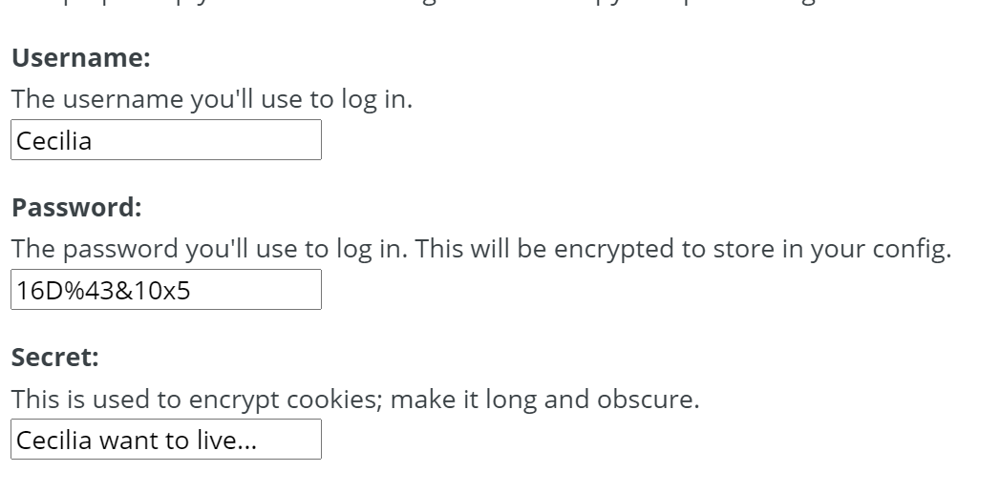

2023.8.8 23:57

(坑)--为什么直接从网页查询的源码保存在本地然后打开会出现异常？

>1. 缺少相关依赖文件：代码中引用了多个外部样式表和字体文件，如果在本地环境中没有正确配置这些文件的路径或者没有下载这些文件，会导致网页显示不正常。
>2. 编码问题：代码中指定了字符集为utf-8，如果使用的文本编辑器或浏览器默认编码不同，可能会导致中文乱码问题。
>3. 跨域访问问题：代码中引入了外部资源，如果在本地访问时存在跨域限制，浏览器可能会阻止加载这些资源。
>4. JavaScript执行错误：代码末尾的<script>标签可能包含JavaScript代码，如果该代码有语法错误或引用了未定义的变量，可能会导致页面交互功能无法正常工作。
>
>需要注意的是，以上问题只是一些可能出现的情况，并非一定会遇到，具体情况还需要根据实际运行环境来确定。
>
>

### _8.13_

 01:39

睡不着，挑战速成html，做一个简易的页面（其实感觉就是看懂了改一改别人的框架？)

03:22

看完了1h的html速成课，结合菜鸟教程来看确实是大概点了一下（毕竟就1h),感觉和之前java做的那种gui蛮像的，主要还是查表），首先知道一些常用的tag，然后再学学css

（蛮像整一个自己的网站，不过好像也不是那么简单（直接用别人的模板那种）


动画效果

> **视差滚动**

### **Docker**

> Docker 是一种开源的容器化平台，它可以让开发者将应用程序和它们的依赖项打包到一个可移植的容器中，从而实现快速部署、可移植性和可伸缩性。Docker 容器是一种轻量级的、独立的、可执行的软件包，它包含了应用程序和它们的依赖项，可以在任何环境中运行。Docker 可以让你在不同的环境中运行相同的应用程序，从而简化了开发、测试和部署过程。
>
> 例如，你可以使用 Docker 来构建一个 Web 应用程序，并将它打包到一个 Docker 镜像中。然后，你可以将这个镜像上传到 Docker Hub 或其他 Docker 镜像仓库中，并在任何地方使用 Docker 运行这个镜像。这样，你就可以在不同的环境中运行相同的应用程序，而无需担心环境差异或依赖项问题。
>
> 
>
> **Docker和虚拟机有什么区别？**
>
> - Docker 是一种轻量级的容器化技术，它可以在操作系统级别上隔离应用程序和它们的依赖项.
>
> - 虚拟机则是一种完整的虚拟化技术，它可以模拟整个操作系统和硬件环境。
>
> - Docker 容器比虚拟机更轻量级、更快速、更易于部署和管理，因为它们共享操作系统内核和硬件资源。而虚拟机则可以提供更高的隔离性和安全性，因为它们模拟了整个操作系统和硬件环境
>
>   
>
> 关于Docker的信息和**教程**？
>
>  Docker 的官方网站
>
> 可以在 Docker Hub上查找 Docker 镜像和容器。
>
> 


如何使用Docker来构建我的应用程序？

> 你可以使用 Dockerfile 来定义你的应用程序和它们的依赖项，并将它们打包到一个 Docker 镜像中。Dockerfile 是一个文本文件，它包含了一系列指令，用于构建 Docker 镜像。例如，你可以使用以下 Dockerfile 来构建一个 Node.js 应用程序：
>
> ```dockerfile
> FROM node:14
> 
> WORKDIR /app
> 
> COPY package*.json ./
> 
> RUN npm install
> 
> COPY . .
> 
> EXPOSE 3000
> 
> CMD [ "npm", "start" ]
> ```
>
> 
>
> 这个 Dockerfile 定义了一个基于 Node.js 14 的 Docker 镜像，它将应用程序代码复制到容器中，并使用 npm 安装应用程序的依赖项。然后，它将暴露应用程序的端口，并定义了一个启动命令。
>
> 你可以使用以下命令来构建这个 Docker 镜像：
>
> ```dockerfile
> docker build -t my-node-app .
> ```
>
> 这个命令会在当前目录中查找 Dockerfile 文件，并使用它来构建一个名为 my-node-app 的 Docker 镜像。然后，你可以使用以下命令来运行这个镜像：
>
> ```dockerfile
> docker run -p 3000:3000 my-node-app
> ```
>
> 这个命令会在本地主机的 3000 端口上运行这个镜像，并将请求转发到容器内部的 3000 端口。


### 9.1

 Q:请解释

```html
 <meta name="viewport" content="width=device-width,initial-scale=1.0">
<meta http-equiv="X-UA-Compatiable" content="ie=edge">
```

A:


1. `<meta name="viewport" content="width=device-width, initial-scale=1.0">`：这个 meta 用于在移动设备上指定视口的宽度和初始缩放比例。其中的属性含义如下：
   - `name="viewport"`：指定该 meta 元素用于设置视口信息。
   - `content="width=device-width, initial-scale=1.0"`：设定视口的宽度与设备宽度一致，并将初始缩放比例设置为 1。这样能确保移动设备上的网页加载时以设备的实际宽度进行布局，而不会产生缩放。

使用上述 meta 标记可以使访问者在移动设备上进行浏览时，网页内容能够适应视口宽度，并保持正确的缩放比例，提供更好的用户体验。

2. `<meta http-equiv="X-UA-Compatible" content="IE=edge">`：这个 meta 用于在旧版本的 Internet Explorer 浏览器中设置文档的解析和渲染模式。属性含义如下：
   - `http-equiv="X-UA-Compatible"`：指定该 meta 元素用于指示浏览器设置。
   - `content="IE=edge"`：指示浏览器使用最新的渲染模式来解析当前网页，而不是使用 IE 浏览器的兼容模式。

通过设置这个 meta 元素，可能会在旧版本的 IE 浏览器（如 IE8）中强制使用最新的渲染引擎，以确保网页能够正常运行和显示效果。


### 9.2

#### JavaScript：验证输入

```js
if(isNaN(x)||x.replace(/(^\s*)|(\s*$)/g,"")==""){
    alert("不是数字");
}
```

#### js basic 

````js
var obj =new Object();//创建一个空对象
var obj2 ={}; 
obj={
    name:"carrot",
    _for:"Max",
    details:{
        color:"orange",
        size:12
    },
    contact:{
        phone:"123-456-7890",
        email:"233@qq.com",
        address:"1234 Main St"
    
    },
}
obj.contact.wechat="123456";
console.log(obj);
console.log(obj.name);
console.log(obj["contact"]["phone"]);
//----array-------
var a =new Array();
var b =[];
a[0]="dog";
a[1]="cat";
a[2]="hen";
b=["dog","monkey","hen"];
console.log(a);
console.log(b);
b.pop();
b.push("fish");

console.log(b);
b.reverse();
b.unshift("lion");//在数组前面添加元素
console.log(b);
var x=5;
console.log(x+5);

 var myString = "Hello World";
 console.log(myString);

 let a=1;
 console.log(a);
 myString = "Hello World 2";
    console.log(myString);
const Pi=3.14;
console.log(Pi);
alert("Hello "+"World");

console.log("hello".length);
console.log("hello".toUpperCase());
console.log("hello".charAt(0));
console.log(Math.random());
console.log("hello".replace("hello","goodbye"));

let age = 25;
console.log(age);   //25

//----闭包-------
function makeAdder(x) { 
    return function(y) { //匿名函数
        return x + y;   //返回一个函数
    };
}

var add5 = makeAdder(5);
var add10 = makeAdder(10);
var sum=add5(2); 
console.log(sum);  // 7
console.log(add10(2)); // 12

function sayHello() { //定义一个函数
    console.log("Hello World");
}
sayHello();

````


#### dom

Document Obeject Model

> POM Projecr Obeject Model

### 9.15

````javascript
//How to accept user input in JavaScript
//1.
let username;
document.getElementById("mybutton").onclick = function() {
    username=document.getElementById("mytext").value;
    console.log(username);
    document.getElementById("mylabel").innerHTML ="Hello, " + username;")";
}
//2.
let username1=window.prompt("what's your name?"); console.log(username1);

````


````js
//Math#
let a;
let b;
let c;
a=windows.prompt("Enter side A");
a=Number(a);
b=windows.prompt("Enter side B");
b=Number(b);
c=windows.prompt("Enter side C");
c=Number(c);
c=Math.pow(a,2)+Math.pow(b,2);
c=Math.sqrt(c);
//c=sqrt(Math.pow(a,2)+Math.pow(b,2));

//2.
document.getElementById("submitButton").onclick=function() {
    a=document.getElementById("aText").value;
    a=Number(a);//force transformation to number
    b=document.getElementById("bText").value;
    b=Number(b);
    c=Math.sqrt(Math.pow(a,2)+Math.pow(b,2));
    document.getElementById("cLabel").innerHTML="Side C:"+c;
}
````


```html
 <div class="container">
        <label id = "mylabel">Enter your name:</label><br>
        <input type="text" id="mytext">
        <button type="button" id="mybutton">submit</button><br>
        <script src="main.js"></script><br>
        <label id="aLabel">Side A:</label> 
        <input type="text" id="aText"><br>
        <label id="bLabel">Side B:</label> 
        <input type="text" id="bText"><br>
        <button type="button" id="submitButton">submit</button><br>
        <label id="cLabel">Side C:</label> 

    </div>
```


console.log("side C:",c);


9.19

#### [maven教程](https://www.liaoxuefeng.com/wiki/1252599548343744/1255945359327200)

intro

> Maven是一个Java项目管理和构建工具，它可以定义项目结构、项目依赖，并使用统一的方式进行自动化构建，是Java项目不可缺少的工具。

#### [Log4j](https://logging.apache.org/log4j/2.x/)


intro

> log4j是一个流行的==Java日志记录框架==。它提供了灵活性和可配置性，使开发人员能够进行高效的日志记录和跟踪。
>
> log4j的关键特性包括：
>
> 1. 日志分级：log4j 支持不同级别的日志，如调试（DEBUG）、信息（INFO）、警告（WARN）、错误（ERROR）和致命（FATAL）。通过设置适当的日志级别，可以根据应用程序的需求灵活控制日志输出。
>
> 2. 输出格式：log4j 可以根据配置将日志输出为各种格式，如简单文本、JSON、XML 等。它还支持自定义输出格式，可以根据需求进行定制。
>
> 3. 日志组织和过滤：log4j 可以根据不同的标准来组织和过滤日志。它允许按类、包、时间戳等维度进行过滤。您可以根据自己的需求配置不同类型的过滤器以获取想要的日志信息。
>
> 4. 日志输出位置：log4j 可以将日志输出到各种目标，如控制台、文件、数据库等。您可以选择性地配置一个或多个输出位置。
>
> 5. 异常处理：log4j 可以捕获和记录应用程序中的异常。每当异常发生时，它将会生成一个包含错误信息和堆栈跟踪的日志记录。这有助于调试和查找问题。
>
> 6. 灵活的配置：log4j 提供了配置文件（如 XML 或属性文件）来定义日志记录器、日志输出和其他属性。配置文件可以被动态更改而无需重新编译或重新部署应用程序。
>
> 总之，log4j是一个功能强大且易于使用的日志记录框架，已被广泛应用于Java应用程序的日志记录和跟踪中。通过使用log4j，开发人员可以轻松地获得高质量的日志，并更好地了解和排除应用程序中的问题。


#### [commos logging](https://commons.apache.org/proper/commons-logging/)

intro

> Commons Logging是一个用于在==Java应用程序中实现日志记录的通用日志接口。==它为开发人员提供了一种友好且统一的方式来管理不同日志系统的实现。
>
> Commons Logging的特点如下：
>
> 1. 抽象接口：Commons Logging提供了一个抽象的Logger接口，开发人员可以使用此接口来记录日志。这使得应用程序可以独立于底层的日志具体实现。
>
> 2. 透明的日志实现：Commons Logging可以使用多个日志实现，包括内置的SimpleLog（仅用于开发和调试），以及常见的日志框架如Log4j，JDK Logging等。通过配置适当的类路径和配置文件，开发人员可以轻松切换日志实现，而无需对代码进行更改。
>
> 3. 自动发现和适配：Commons Logging支持自动发现具体的日志实现。它会尝试使用当前环境中存在的所有已知日志实现，并选择适用的实现。这降低了使用和迁移的复杂性。
>
> 4. 日志级别：Commons Logging支持日志级别的定义和控制。您可以使用级别如DEBUG，INFO，WARN和ERROR来控制日志输出的详细程度。这有助于在不同环境中灵活地配置和过滤要输出的信息。
>
> 5. 运行时调整：Commons Logging支持通过更改配置文件动态地调整日志级别。这意味着您可以在不重新编译或重新部署应用程序的情况下更改日志级别，从而有助于故障排除和调试。
>
> 总的来说，Commons Logging赋予了开发人员在Java应用程序中使用日志记录的灵活性和可移植性。它提供了一个简单的接口和对常见日志实现的透明支持，使得日志记录变得高效、可配置和易于管理。


### 9.19

##### （坑）npm报错

1.npm ERR! code E403

> [csdn](https://blog.csdn.net/qq_35664065/article/details/122977681)

2.取消镜像

`npm config set registry https://registry.npmjs.org/`

3.使用镜像

`npm config set registry https://registry.npmmirror.com/`


3.npm publish 出错

> 1.[网络原因](https://www.cnblogs.com/yalong/p/11495661.html)

> npm ERR! code ERR_STRING_TOO_LONG
> npm ERR! Cannot create a string longer than 0x1fffffe8 characters
>
> npm ERR! A complete log of this run can be found in: D:\node_js\node_cache\_logs\2023-09-19T07_31_55_550Z-debug-0.log

(未解决)


[Web.lab crash course](https://weblab.mit.edu/schedule/)


- vs安装插件Prettier Formatter for Visual Studio Code
  - ~~快捷键Ctrl+s(美化格式)~~

double dash : //


##### -css flextbox

https://css-tricks.com/snippets/css/a-guide-to-flexbox/

练习网站

https://flexboxfroggy.com/

http://www.flexboxdefense.com/

> CSS Flexbox是一种用于创建灵活、响应式的布局的CSS模块。Flexbox提供了一套强大的布局工具，使开发者能够轻松地在容器内部对项目进行排序、对齐和分布，以及适应不同尺寸屏幕和设备。
>
> 以下是Flexbox的一些主要特点和概念：
>
> 1. 弹性容器（Flex containers）：使用Flexbox布局的元素称为弹性容器。通过将元素的父级容器设置为`display: flex`，就可以将其转换为弹性容器。
>
> 2. 弹性项目（Flex items）：弹性容器内的每个元素称为弹性项目。弹性项目根据弹性容器的布局规则定位和排列。
>
> 3. 主轴（Main axis）和交叉轴（Cross axis）：弹性容器具有一个主轴和一个交叉轴。默认情况下，主轴是水平轴，交叉轴是垂直轴。弹性项目可以在主轴上排列，也可以在交叉轴上对齐。
>
> 4. 弹性布局属性：通过使用一些简单的CSS属性，开发者可以控制弹性容器和弹性项目的布局样式。这些属性包括`flex-direction`、`justify-content`、`align-items`等，它们控制项目的排序、对齐和分布方式。
>
> 5. 响应式设计：Flexbox能够根据屏幕尺寸和设备特性自动调整布局。它可以很容易地实现响应式设计，并适应各种屏幕大小和设备类型。
>
> Flexbox是一种强大而直观的布局工具，使得构建复杂的网页布局变得更加简单和灵活。它适用于各种场景，包括导航菜单、图片库、网格布局、响应式布局等。学习和掌握Flexbox将使开发人员能够更高效地编写具有吸引力的页面布局。

#### js-function

两种写法

```js
//1.
function sayHello2(name) {
    console.log("Hello " + name);
}
sayHello2("Cecilia");

//2. Syntax: (parameters) => { body };
const celsiusToFahrenheit = (tempC) => { //celcius to fahrenheit
    const tempF = tempC * 1.8 + 32;
    return tempF;
};
console.log(celsiusToFahrenheit(10));   //50
```

-**Callback functions**

```js
const adTwo = x => {
    return x + 2;
};
const modifyArray = (array, callback) => {
    for (let i = 0; i < array.length; i++){
        array[i] = callback(array[i]);
    }
};
let myArray = [5,10,15,20];
modifyArray(myArray, addTwo);	//[7,12,17,22]
```

**Anonymous functions**

Syntax: (parameters) => output;

```js
const modifyArray = (array, callback) => {
    for (let i = 0; i < array.length; i++){
        array[i] = callback(array[i]);
    }
};

let myArray = [5, 10, 15, 20];
modifyArray(myArray, x => {
    return x+2;
});
```

##### - map

```js
let myArray = [1,2,3,4,5];
let modifiedArray = myArray.map(x => x*3);
// modifiedArray == [3,6,9,12,15]

let celciusArray = [0,10,20,30,40];
let fahrenheitArray = celciusArray.map(celsiusToFahrenheit);
// fahrenheitArray == [32,50,68,86,104]
```

##### - fliter

```js
//--fliter--
let values = [1,2,3,4,5,6,7,8,9,10];
let evenValues = values.filter(x => x%2 == 0);
// evenValues == [2,4,6,8,10]
let values2 = [3,-6,8,-2,9,-4,0];
let positiveValues = values2.filter(x => x >= 0);
// positiveValues == [3,8,9,0]
const staffNames = ["John", "Jane", "", "Jackie"];
const shortNames = staffNames.filter(name => name != "" && name.length <= 4);
// shortNames = ["John", "Jane"]
```

//One way to copy arrays and objects is to use the spread operator (...) like so:

````js
let myArra1 = [1,2,3,4,5];
let myArray2 = [...myArray1];

let obj = {name :"Bill Gates"};
let copyObj = {...obj};
````


### 9.20

- [ ] #todo 配置vscode，目前无法调试nodejs文件
- [ ] #todo 找出vscode无法在输出框接受键盘输入的原因

React

> React是一个**用于构建用户界面的JavaScript库**。它由Facebook开发和维护，并且应用广泛。React使用组件化的方式来构建用户界面，通过将界面拆分为独立且可重用的组件，使开发人员能够以模块化的方式构建复杂的UI结构。
>
> React使用一种叫做**JSX的语法**，它允许在JavaScript代码中嵌入类似HTML的标记。这使得开发者能够以声明性的方式编写组件，并将其渲染为DOM元素。React使用虚拟DOM（Virtual DOM）技术来管理和更新界面，以高效地处理UI更新和重新渲染的过程。
>
> React还引入了一种称为"状态"（state）的概念，用于在组件中存储和管理数据。当状态发生变化时，React会自动更新组件的界面，以反映这些变化。这种响应式的更新机制使开发人员能够轻松地管理和同步UI与应用程序数据之间的关系。
>
> React具有较高的可组合性和可重用性，因此它在大型应用程序的开发中非常受欢迎。它还有一个活跃的社区，提供了大量的扩展库和工具，用于增强React的功能和便利开发。
>
> 简而言之，React是一个用于构建用户界面的JavaScript库，它以组件化、声明性的方式来构建UI，并使用虚拟DOM和状态管理来实现高效、高响应的界面更新。它在现代Web开发和移动应用开发中被广泛应用和推崇。

React Native

> React Native是一种可以用来开发手机应用的工具，它使用JavaScript语言和React的方式来创建应用程序。使用React Native，开发者可以只写一次代码，即可同时在iOS和Android等多个平台上运行应用程序。它使得开发速度更快，应用程序的性能和外观也与原生应用程序相当。无需重新编译，开发人员可以实时在开发过程中查看界面的变化，可以更快地进行开发和测试。React Native还有一个大型社区和生态系统，开发人员可以使用现成的组件和工具来构建功能丰富的应用程序。

**npm**

Node Package Manager

(坑)nodejs 里的erro

1.使用require导入模块时报错

> - chalk最新版本不支持require导入--> 使用import语法导入
>
> - [参考](https://blog.csdn.net/bhegi_seg/article/details/123351538)
>
> - node.js报错 ReferenceError: require is not defined 解决方案分享
>
> - - 今天在应用 node.js 的时候突然报错了，之前一直是好的呢，费了九牛二虎之力终于搞明白了。
>      原来是node在升级之后，对 require 的使用方法发生了改变。**从node.js 14版及以上版本中，require作为COMMONJS的一个命令已不再直接支持使用，所以我们需要导入createRequire命令才可以。**
>      所以在使用 require 的时候只需要加入以下代码就可以了：
>
>     ```javascript
>     import { createRequire } from 'module';
>     const require = createRequire(import.meta.url);
>     ```
>
>     参考2：
>
>   - https://www.cnblogs.com/Megasu/p/16635566.html

2.SyntaxError: Cannot use import statement outside a module

> - 没有配置pakage.json--> [csdn](https://blog.csdn.net/weixin_44505553/article/details/108830616)


#### require和import

回顾文章：https://newsn.net/say/node-run-es6.html

- 通常来说使用`node xxx.js`来执行的代码，就是`commonjs`标准的。使用`require("xxx")`来导入第三方模块。

- 而使用`node xxx.mjs`来执行的代码，或者`package.json`里面定义了`type:module`，或者各种编译类型（例如`webpack`）的，就都是属于`es module`类型（或者称之为`es`模块）。使用`import("xxx")`来导入第三方模块。

- > 
  >
  > ##### 解决方案一：`await`【推荐】
  >
  > 普通的`commonjs`环境下，对比如下：
  >
  > ```js
  > const { nanoid } = require('nanoid')
  > ```
  >
  > vs
  >
  > ```js
  > const { nanoid } = await import('nanoid');
  > ```
  >
  > 也就是`require('xxx')`字样变成了`await import('xxx')`字样。但是，由于使用了`await`，大多数情况下，还需要一个`async`包裹一下对应的语句。
  >
  > ```js
  > (async ()=>{
  >     const { nanoid } = await import('nanoid');
  >     console.log(nanoid(5));//调用的部分
  > })();
  > ```


修改示例

`var readlineSync = require('readline-sync');`

```js
import {createRequire} from 'module';//
const require = createRequire(import.meta.url);//
const readlineSync = require('readline-sync');
```


#### -inquirers.js

> Inquirer.js确实更加强大，直接将多个问题以对象数组的形式组织到一起，并且针对密码类型的输入也做了隐藏处理。
>
> Inquirer.js官网对使用方式说明得十分详细，我做一下简单概括，questions是一个对象数组，你可以把它当成一个表单，每个对象代表一个问题的所有相关内容。
>
> 其中，**type**、name、**message**是最常用的属性。
>
> **type**表示回答问题的方式，包括input（输入框）, number（数字）, confirm（确认框）, list（列表）, rawlist（原始列表）, expand（展开列表）, checkbox（多选框）, password（密码）, editor（编辑器）9种。name表示存储在答案中的字段名称，message表示提问的问题。
>
> 除了以上三个属性，还有11个不是常用的属性，分别是：
> **default：**答案默认值。
> **choice：**列表的选项，对象数组。其中list、rawlist、checkbox的选项对象都是value和name组合，类似：
>
> ````js
> {
>     value: 'tennis',
>     name: 'tennis'
> }
> ````
>
> 
>
> **expand**比较特殊，使用key和value的组合，类似：
>
> ```js
> {
>     key: 'R',
>     value: 'red'
> }
> ```
>
> **validate**：用于校验输入内容，是一个函数，只有返回ture时，回车才会生效。
> filter：用于将答案进行二次处理，是一个函数，返回值是答案的最终值。
> **transformer**：在输入的信息后添加的提示信息，可以把它当成input的placeholder，对最终答案没有影响，是一个函数。
> when：是一个函数，参数是answer，当返回值是true时，该问题才会生效并且进行提问。
> **pageSize**：分页器，给list、rawList,、expand、checkbox列表使用，输入数字（代表每页多少个选项），当数字小于列表总选项时，会进行分页。
> 
>   prefix**：问题前缀。
> suffix：问题后缀。
> **askAnswered**：Boolean值，默认情况下为false，同样的答案字段如果已经存在则不会发起提问，但是如果为true，则会强制提问，并且新的答案会覆盖之前的。
> **loop**：Boolean值，默认值为true。通常和pageSize使用，为true时，列表到最后一页继续前进的话会返回第一页。为false时，则不会。
>
> 参考
>
> > D:\nodejs_project\learn_nodejs\inquirerEg.js
>
> 

 

#### -Font Awesome

https://fontawesome.com/kits

Font Awesome 是一个流行的矢量图标库，它包含一系列用于网页、应用程序和其他设计项目的图标。你可以使用这些图标来增加用户界面的可视吸引力，并向用户传达信息。 

> Font Awesome 是一套绝佳的图标字体库和CSS框架。
>
> Font Awesome 字体为您提供可缩放矢量图标,它可以被定制大小、颜色、阴影以及任何可以用CSS的样式。
>
> 要使用Font Awesome图标，请在HTML页面的  部分中添加以下行：
>
> 1、国内推荐 CDN：
>
> ```js
> <link rel="stylesheet" href="https://cdn.staticfile.org/font-awesome/4.7.0/css/font-awesome.css">
> ```
>
> 2、海外推荐 CDN
>
> ```js
> <link rel="stylesheet" href="https://cdnjs.cloudflare.com/ajax/libs/font-awesome/4.7.0/css/font-awesome.min.css">
> ```
>
> 3、直接下载到本地
>
> https://static.runoob.com/download/font-awesome-4.7.0.zip

#### 教程网站

https://nqdeng.github.io/7-days-nodejs/

### 9.21
html , CSS
```js
<i class="fa fa-car" style="font-size:36px;color:rgb(255, 225, 73)"></i>
```
每个 `<i>` 元素都有两个类名：
- `fa`：指示元素是 Font Awesome 图标。
- `fa-car`：指示要显示的具体图标是汽车。

> `<i>` 元素用于表示斜体或文本的其他不同视觉样式。然而，在实际开发中，`<i>` 元素通常被用于表示图标，如使用 Font Awesome 图标库中的图标。它是一个内联元素，通常用作表示图标的容器。您可以使用 CSS 设置其样式、颜色、大小和其他属性。
>
> `<div>` 元素是一个块级元素，它用于创建一个分割、容器或组。它没有特定的含义，因此适合用于组合其他元素或以块级方式划分内容。它可以通过 CSS 设置宽度、高度、背景、边距等属性，自定义样式以实现各种布局和分区需求。


`target="_blank"`

> 。当你点击一个带有 `target="_blank"` 属性的链接时，链接的目标内容会在一个新的Tab页或浏览器窗口中加载，而不会替换当前页面。


#### CSS 伪类

(Pseudo-classes)

> CSS伪类是用来添加一些选择器的特殊效果。

```css
a:link {color:#FF0000;} /* 未访问的链接 */
a:visited {color:#00FF00;} /* 已访问的链接 */
a:hover {color:#FF00FF;} /* 鼠标划过链接 */
a:active {color:#0000FF;} /* 已选中的链接 */
```

> **注意：** 在CSS定义中
>
> - a:hover 必须被置于 a:link 和 a:visited 之后，才是有效的。
>
> - a:active 必须被置于 a:hover 之后，才是有效的。
>
> - 伪类的名称不区分大小写。

- [x] #todo CSS导航栏
- [ ] #todo CSS伪元素


### *9.22*

Q:tomcat应用在idea中和VScode直接live sever显示html，css，js效果有什么区别

> Tomcat 是一个基于Java的Web服务器和Servlet容器，可以用于部署和运行Java Web应用程序。在IDEA中，您可以配置Tomcat并将您的Java Web应用程序部署到Tomcat上，并通过浏览器访问运行中的应用程序。
>
> 相比之下，VScode的 Live Server 扩展是一个用于创建本地开发服务器和动态刷新浏览器查看页面效果的工具。通过 Live Server，您可以直接在浏览器中打开并查看HTML、CSS和JavaScript文件的效果，无需配置任何额外的服务器。
>
> 在实际开发中
>
> - 使用Tomcat可完整地模拟并测试Java Web应用程序
> - 而VScode的Live Server则更适合快速迭代和调试前端代码。选择适合您当前项目和开发流程的工具既可以提高开发效率，又可以获得更好的开发体验。


#坑 下载tomcat无法打开starup.bat（闪退）

1.解决闪退

> 用记事本打开starup.bat文件,在最后一行添加pause，这样bat文件在运行之后会暂停一会儿。可以看到报错原因。

显示问题如下

> error:NB: JAVA_HOME should point to a JDK not a JRE.

已解决

> 来源：看的教程是老版本的tomcat，我下载的是tomcat10.1.13，支持jdk11及以上。在配置path的时候，教程添加了jre的路径，但是jdk9之后，JDK 和 JRE 被整合在一起。 所以配置的路径有问题。
>
> - ==solution==：在path中删除%JAVA_HOME%\jre
>
> 
>
> JDK 中的 bin 目录包含了用来开发和构建 Java 应用程序的工具和程序，lib 目录包含了用于支持编译和运行 Java 应用程序的库文件，而 JRE 目录中的文件已经被 JDK 整合进了相应的子目录。

- [x] 配置tomcat

### 10.1
- 尝试做SJTU 的webapp开发项目，先跟着学习！ 
	github:https://github.com/Musicminion/SJTU-SE2321-Web-Application-Development-PPT
- 关于自己想设计的网站，想增加支持openai的功能，所以后期也得学一下这方面的部署


### 10.6

#### **[reveal.js](https://github.com/hakimel/reveal.js)**         

> reaveal.js 是一个基于 web 技术的开源演示文稿框架。它允许用户创建漂亮、交互式的幻灯片转换。reveal.js 通过 HTML、CSS 和 JavaScript 实现，能够生成具有动态过渡效果和多媒体支持的现代演示文稿。
>
> 使用 reveal.js，您可以创建具有各种自定义主题、布局和演出效果的演示文稿。它提供了许多现成的漂亮样式和配置选项，可以轻松地在幻灯片中添加图像、视频、音乐和其他媒体元素，并支持 Markdown、HTML 和 PDF 导出。
>
> reveal.js 具有许多强大功能，如：
>
> - 幻灯片布局：支持横向和纵向布局，以及分屏布局。
> - 主题和样式：提供了多个主题和样式供选择，也可以自定义样式来符合您的设计需求。
> - 转换效果：支持多种转场效果，如滑动、淡出、缩放等。
> - 代码展示：内置了代码展示功能，支持多种编程语言的代码美化和高亮显示。
> - 演讲者模式：可以实时预览幻灯片，并在另一个窗口中提供演讲者笔记等辅助功能。
> - 键盘和鼠标导航：支持使用键盘和鼠标控制演示，在全屏模式下进行交互。
>
> reveal.js 还具有跨平台的特性，可以进行跨设备和浏览器的兼容性，包括桌面和移动设备。为了使用 reveal.js，您只需将相关的 HTML、CSS 和 JavaScript 文件添加到您的项目中，并按照框架的结构创建您的演示文稿内容即可。
>
> 总结来说，reveal.js 是一个强大而灵活的演示文稿框架，可以帮助您创建专业、互动和具有个性化风格的演示文稿。它秉承了 web 技术的优点，使得演示更加优雅和灵活。


[支持 Markdown 的网页 slides 工具总结](https://blog.csdn.net/yeasy/article/details/41480435)


(原本是想用网页做一个课程展示，感觉单纯html+css也能完成，reveal.js主要还是把markdown演示出来，实际上的效果和ppt也差不多，可能是我还不太会用吧)


- 关于开发

  （学了这么久HTML+css+js，还是不知道的在学什么，也在了解webpack，redis，ruby这些，感觉好乱啊，想做成一个项目，把这些知识都联系起来……但是还没有想到/找到合适的）


- Vercel和GitHub Pages都是用于托管静态网站的流行平台

- 问题还是出在不知道为“什么”而做，没有具体的需求感觉无法去构思一个有用的东西……不想照着网上的教程做一个电商网页（感觉很没用

 

### *10.8*

- #坑 创建maven管理的web项目出错：

  “加载maven插件的时候出错

  ->解决：clean之后重新install（感觉是网络问题）

  [Could not transfer artifact xxxx依赖找不到](https://blog.csdn.net/newoneobjectddd/article/details/124706372)

- #坑 取消/启用vscode自动换行：`Alt+z`

  

Lab作业：

> - `getElementById("sendButton")` 表示通过元素的 ID 获取 HTML 元素的引用，这里是指发送按钮。
> - `onclick` 是一个事件处理程序，当指定的元素被单击时，其内部的函数将被触发。
> - `document.createElement("p")` 创建一个新的 HTML 元素，这里是一个段落 `<p>` 元素，用于包裹聊天消息。
> - `getElementById("messageInput")` 获取输入框的引用，用于获取用户输入的信息。
> - `textContent` 属性用于获取或设置元素的文本内容。
> - `appendChild(messageElement)` 将子元素添加到父元素的末尾。这里是将新的聊天消息元素（`messageElement`）添加到聊天框（`chatBox`）中。
> - `messageInput.value` 获取输入框中的值，即用户输入的聊天消息。
> - `messageInput.value = ""` 将输入框的值设置为空，清空输入框中的内容。
> - `chatBox.scrollTop` 获取或设置聊天框的滚动条的垂直位置。
> - `chatBox.scrollHeight` 获取带有滚动条的聊天框的内容的总高度，包括可见部分和可滚动但不可见的部分。
>
> 以上都是通过标准的 JavaScript 函数来完成DOM操作。这些函数用于从 HTML 元素的内容提取和设置值，以及获取、创建和附加 HTML 元素到 DOM 结构。通过使用这些函数，我们可以根据用户的输入和交互来构建动态的聊天室界面。
>
>  

### *10.9*

#### css-渐变背景

><gradient>
>
>**`<gradient>`** [CSS](https://developer.mozilla.org/zh-CN/docs/Web/CSS) [数据类型](https://developer.mozilla.org/zh-CN/docs/Web/CSS/CSS_Types) 是 [``](https://developer.mozilla.org/zh-CN/docs/Web/CSS/image) 的一种特殊类型，包含两种或多种颜色的过渡转变。
>
>CSS 渐变[没有内在尺寸](https://developer.mozilla.org/zh-CN/docs/Web/CSS/image#描述)，也就是说，它没有固有或首选的尺寸，也没有首选的比例，其实际大小取决于所应用的元素的大小。
>
>[语法](https://developer.mozilla.org/zh-CN/docs/Web/CSS/gradient#语法)
>
>`<gradient>` 数据类型是由下面列出的函数类型中的一个定义的。
>
>[线性渐变](https://developer.mozilla.org/zh-CN/docs/Web/CSS/gradient#线性渐变)
>
>线性渐变会在一个假想的直线上过渡颜色。线性渐变是由 [`linear-gradient()`](https://developer.mozilla.org/zh-CN/docs/Web/CSS/gradient/linear-gradient) 函数产生的。
>
>[径向渐变](https://developer.mozilla.org/zh-CN/docs/Web/CSS/gradient#径向渐变)
>
>径向渐变从一个中间点（原点）开始过渡颜色。径向渐变是由 [`radial-gradient()`](https://developer.mozilla.org/zh-CN/docs/Web/CSS/gradient/radial-gradient) 函数产生的。
>
>[重复渐变](https://developer.mozilla.org/zh-CN/docs/Web/CSS/gradient#重复渐变)
>
>重复渐变可根据需要复制渐变，以填充指定区域。重复渐变是使用 [`repeating-linear-gradient()`](https://developer.mozilla.org/zh-CN/docs/Web/CSS/gradient/repeating-linear-gradient) 和 [`repeating-radial-gradient()`](https://developer.mozilla.org/zh-CN/docs/Web/CSS/gradient/repeating-radial-gradient) 函数生成的。
>
>[锥形渐变](https://developer.mozilla.org/zh-CN/docs/Web/CSS/gradient#锥形渐变)
>
>锥形渐变会沿着一个圆过渡颜色。锥形渐变是由 [`conic-gradient()`](https://developer.mozilla.org/zh-CN/docs/Web/CSS/gradient/conic-gradient) 函数产生的。


- !在webstorm里面成功创建了vue项目！


#### 图片资源网站

> 以下是一些免费的高清图片资源网站：
>
> 1. [**Pixabay**：提供超过 4.2 百万张优质图片和视频素材，全部免费使用和下载](https://www.entrepreneur.com/growing-a-business/7-sources-of-free-high-quality-stock-images/248683)[1](https://www.entrepreneur.com/growing-a-business/7-sources-of-free-high-quality-stock-images/248683)[2](https://pixabay.com/)。
> 2. [**Pexels**：提供高质量的免费图片和视频素材，无需注明归属](https://www.entrepreneur.com/growing-a-business/7-sources-of-free-high-quality-stock-images/248683)[2](https://pixabay.com/)[3](https://www.pexels.com/)。
> 3. [**Unsplash**：提供免费的高质量图片和视频素材，无需注明归属](https://unsplash.com/)[4](https://unsplash.com/)。
> 4. [**StockSnap**：提供免费的高清图片资源，每周更新](https://www.entrepreneur.com/growing-a-business/7-sources-of-free-high-quality-stock-images/248683)[5](https://zapier.com/blog/best-free-stock-photos/).
> 5. [**Flickr**：提供超过 10 亿张免费的高清图片资源，可以根据不同的许可证进行筛选](https://zapier.com/blog/best-free-stock-photos/)[5](https://zapier.com/blog/best-free-stock-photos/).
> 6. [**Burst**：提供免费的高清图片资源，适用于电子商务公司](https://www.entrepreneur.com/growing-a-business/7-sources-of-free-high-quality-stock-images/248683)[5](https://zapier.com/blog/best-free-stock-photos/).
> 7. [**New Old Stock**：提供古老的历史照片，可以免费使用](https://www.entrepreneur.com/growing-a-business/7-sources-of-free-high-quality-stock-images/248683)[5](https://zapier.com/blog/best-free-stock-photos/).

#### imgix.com

https://imgix.com/

一个综合性的视觉媒体解决方案，可以让您更好地控制您的网站或应用程序中的图像和视频。它有免费试用期，价格也很灵活。


#### [滚动进度动画](https://developer.mozilla.org/en-US/blog/scroll-progress-animations-in-css/)


#### Linear() 函数
 [Linear() 函数在 CSS 动画中创建自定义缓动效果](https://developer.mozilla.org/en-US/blog/custom-easing-in-css-with-linear/)


[分享](https://ruby-china.org/topics/node26) Web 中文字体应用指南


#### div里面id和class的区别

> 在 HTML 中，`class` 和 `id` 是用于为元素添加标识符的属性。它们之间的主要区别如下：
>
> 1. 唯一性限制：`id` 属性的值必须在整个 HTML 文档中具有唯一性，即每个元素只能有一个唯一的 id 值。而 `class` 属性的值可以在文档中多次使用，同一个值可以用于多个元素。
>
>    例如：
>    ```html
>    <div id="my-element"></div> <!-- 唯一的 id -->
>    <div class="my-class"></div> <!-- 与其他元素共享相同的 class -->
>    ```
>
> 2. 选择器引用：`id` 属性可以用作 CSS 或 JavaScript 的选择器，以唯一地标识一个特定的元素。可以使用 `#` 符号来引用 id，如 `#my-element`。而 `class` 属性可以作为 CSS 或 JavaScript 的选择器引用，以同时选择多个具有相同 class 的元素。选择器使用 `.` 符号来引用 class，如 `.my-class`。
>
> 3. 特定性：`id` 属性的特定性较高，这意味着与 `id` 相关的规则在样式和 JavaScript 中的优先级更高。而 `class` 属性的特定性较低，适合用于定义多个元素的共享样式。
>
>    例如，假设您同时定义以下两条规则：
>    ```css
>    #my-element {
>        color: red;
>    }
>                                                          
>    .my-class {
>        color: blue;
>    }
>    ```
>    在这种情况下，`id` 规则的优先级更高，所以应用红色文本颜色的是具有 `id="my-element"` 的元素。
>
> 综上所述，`class` 属性和 `id` 属性在对元素进行标识和选择时有不同的用途和限制。`id` 用于唯一的标识和引用一个元素，而 `class` 用于在多个元素之间共享属性或样式。


### 10.10

- [ ] #todo 将整体的布局大小改为适应网页窗口大小
- [ ] 写一个servelet提供更多课程的信息（先了解知识
- [ ] （可选）优化hover效果，找一些图片看看能不能做成视差效果
- [ ] 六点去做项目

#### 异步JavaScript

[简介](https://developer.mozilla.org/zh-CN/docs/Learn/JavaScript/Asynchronous/Introducing)

> 异步vs同步
>
> 异步函数为我们提供：
>
> - 通过调用一个函数来启动一个长期运行的操作
> - 让函数开始操作并立即返回，这样我们的程序就可以保持对其他事件做出反应的能力
> - 当操作最终完成时，通知我们操作的结果。
>
> 

#### 导入servlet

错粗写法：

```
import javax.servlet.*
```

正确写法

```
import jakarta.servlet.*
```


#坑 Cannot resolve symbol 'JSONArray'

[Intellij Ideal 解决“cannot resolve symbol 'json'”问题](https://blog.csdn.net/ly_solo/article/details/88975642)


- [idea使用jsp页面实时更新，tomcat配置](https://blog.csdn.net/weixin_44245604/article/details/105220163?utm_medium=distribute.pc_relevant.none-task-blog-2~default~baidujs_baidulandingword~default-4-105220163-blog-74171050.235^v38^pc_relevant_sort_base3&spm=1001.2101.3001.4242.3&utm_relevant_index=7)
  - [idea热部署没有Update classes and resources选项](https://blog.csdn.net/qq_36509946/article/details/99566654)


"C:\Users\08042x'l\IdeaProjects\demo1\src\main\java\com\example\demo1\HelloServlet.java"


### 10.11

####  nodejs项目

[awesome-nodejs](https://github.com/sindresorhus/awesome-nodejs)


### 10.13

#### react

> Ant Design of React
> ●https://ant.design/docs/react/introduce-cn
> React Router中文文档
> ●http://react-guide.github.io/react-router-cn/index.html
> React Router使用教程
> https://www.jianshu.com/p/ 78d551b6d1ac
> 在ReactRouter4中建立具有權限檢核的PrivateRoute組件
> https://dotblogs.com.tw/wasichris/2018/01/22/002904
> React- Router v4简单入门教程.
> ●https:/ /www.jianshu.com/p/5e8297858ea8
> React Router Tutorial
> ●https://www.codingame.com/ playgrounds/6517/react-router-tutorial

"D:\GameMaker.


### *10.19*

#### Vue3

##### 一. Vue简介

 Vue是于2013年(与React框架同年发布)推出的一个渐进式、**自底向上**的前端框架，它的作者叫尤雨溪。那么什么叫做**渐进式框架**呢？比较官方的说法就是：以Vue内核作为核心，随着业务的深入、需求的递增，可以使用其周边生态(vue-router、vuex、ssr等)深度应用到项目中。那么通俗上来讲：就是我们可以使用vue的部分功能不断的迭代掉我们项目中部分的功能，从表单提交到列表渲染，再到多路由应用，再到SSR等。

 Vue主要具备以下几个特点：

- 解耦视图和数据
- 组件复用
- 前端路由
- 状态管理
- 虚拟DOM

Vue的学习不需要你具备 Rect、Angular的基础，只需要具备HTML、CSS、Javascript的基础即可。

##### 二、Vue特点

> Vue的特点
>
> (1) Vue 的核心库只关注视图层。
> (2) 不仅易于上手，还便于与第三方库或既有项目整合。
> (3) 遵循 MVVM模式 ，能够实现视图与模型的 双向绑定。
>
> - ==MVVM模式==：就是数据变化的时候, 页面会自动刷新, 页面变化的时候，数据也会自动变化.
>
> (4) 编码简洁，体积小，运行效率高，适合移动/PC端开发。
> ————————————————

##### 三、声明式渲染

Vue.js 的核心是一个允许采用简洁的模板语法来**声明式**地将数据渲染进 DOM 的系统

> 注意：
>
> 想让Vue工作，就必须创建一个 Vue实例，且要传入一个 配置对象
> root容器里的代码依然符合html规范，只不过混入了一些特殊的Vue语法
> root容器里的代码被称为 Vue模板
> Vue实例与容器是一一对应的
> 真实开发中只有一个Vue实例，并且会配合着组件一起使用
> {{xxx}} 中的xxx要写js表达式，且xxx可以自动读取到data中的所有属性
> 响应式 就是一旦data中的数据发生变化，那么模板中用到该数据的地方也会自动更新


#### github-eg

[vue-slider-component](https://github.com/NightCatSama/vue-slider-component/blob/master/README-CN.md#vue-slider-component)

[vue2-calendar](https://blog.w3cub.com/vue2-calendar/?x-page=github)

[A hackable slideshow framework built with Vue.js](https://github.com/Zulko/eagle.js)


#### Runoob

- vue安装
- vue打包
- vue创建项目
  - vue init 
  - vue create [options] <app-name>
  - 使用可视化创建工具来创建项目：vue ui


#### Youtobe

https://www.youtube.com/watch?v=1GNsWa_EZdw (4h)


### 10.22

#### JSP 和 Servlet

> 1. **用途**:
>    - **JSP（JavaServer Pages）** 是一种基于文本文件的模板技术，允许在其中嵌入 Java 代码。JSP 文件通常包含 HTML 和 Java 代码，用于呈现 Web 页面。
>    - **Servlet** 是一种 Java 类，它在服务器端处理 HTTP 请求和响应。Servlet 通常用于执行后端逻辑，如数据处理、业务逻辑和请求处理。
> 2. **编程方式**:
>    - **JSP** 更侧重于将 Java 代码嵌入到 HTML 页面中，使页面更易于维护和编写。
>    - **Servlet** 更侧重于在 Java 类中处理请求和生成响应，通常需要编写更多的 Java 代码。
> 3. **可维护性**:
>    - **JSP** 更适用于前端开发人员，因为他们可以在页面中添加少量 Java 代码，而无需深入了解 Java 后端编程。
>    - **Servlet** 更适用于后端开发人员，因为他们需要编写 Java 代码来处理请求和生成响应。
> 4. **性能**:
>    - 由于 JSP 在运行时会转换为 Servlet，因此性能方面没有太大区别。
>    - Servlet 可能更适用于处理大量请求，因为它可以更精细地控制请求和响应的处理。
> 5. **分工**:
>    - 在实际的 Web 应用程序中，通常会同时使用 JSP 和 Servlet。JSP 用于生成 HTML 页面，Servlet 用于处理表单提交、执行业务逻辑等。
> 6. **模板和控制器**:
>    - JSP 可以看作是模板，用于视图层。
>    - Servlet 通常用于控制器，处理请求的控制逻辑。


### 10.23

IDEA报错is not assignable to javax.servlet.Servlet

> [csdn](https://blog.csdn.net/weixin_42172723/article/details/128882982?spm=1001.2101.3001.6661.1&utm_medium=distribute.pc_relevant_t0.none-task-blog-2%7Edefault%7EBlogCommendFromBaidu%7ERate-1-128882982-blog-98930944.235%5Ev38%5Epc_relevant_sort_base3&depth_1-utm_source=distribute.pc_relevant_t0.none-task-blog-2%7Edefault%7EBlogCommendFromBaidu%7ERate-1-128882982-blog-98930944.235%5Ev38%5Epc_relevant_sort_base3&utm_relevant_index=1)
>
> 2.在web.xml里面引入的servlet.java没有extends HttpServlet
>
> 
>
> 
>
> 


#### servlet板子

```java
package com.example.demo1;

import jakarta.servlet.*;
import jakarta.servlet.http.*;
import jakarta.servlet.annotation.*;

import java.io.IOException;

@WebServlet(name = "note", value = "/note")
public class note extends HttpServlet {
    @Override
    protected void doGet(HttpServletRequest request, HttpServletResponse response) throws ServletException, IOException {

    }

    @Override
    protected void doPost(HttpServletRequest request, HttpServletResponse response) throws ServletException, IOException {

    }
}
```


#坑 Cannot resolve taglib with uri http://java.sun.com/jsp/jstl/core

> [csdn](https://blog.csdn.net/zhangzehai2234/article/details/50973095?ops_request_misc=%257B%2522request%255Fid%2522%253A%2522169805811416800197071864%2522%252C%2522scm%2522%253A%252220140713.130102334..%2522%257D&request_id=169805811416800197071864&biz_id=0&utm_medium=distribute.pc_search_result.none-task-blog-2~all~top_positive~default-1-50973095-null-null.142^v96^pc_search_result_base2&utm_term=Cannot%20resolve%20taglib%20with%20uri%20http%3A%2F%2Fjava.sun.com%2Fjsp%2Fjstl%2Fcore&spm=1018.2226.3001.4187)
>
> 解决方法：
>
> 在jsp开发的时候可能会碰到这个错误，其实这个问题很简单，只是缺少对于jsp支持的jar包，这两个jar包分别是：jstl.jar和standard.jar。
>
> 如果你使用的是maven的话，只需要在pom.xml文件里面加入这两个jar包即可
>
> ```xml
> <span style="font-size:18px;"><dependency>
>       <groupId>javax.servlet</groupId>
>       <artifactId>jstl</artifactId>
>       <version>${javax.servlet.jstl}</version>
>     </dependency>
>     <dependency>
>       <groupId>taglibs</groupId>
>       <artifactId>standard</artifactId>
>       <version>${taglibs.standard}</version>
>     </dependency></span>
> ```
>
> 如果没有使用maven框架的话，只需要手动的下载这两个jar包，然后把他们放到项目的WEB-INF/lib文件夹，然后将jar包构建到项目路径中即可
>
> 2. [下载依赖包：](https://blog.csdn.net/shenhaibb_/article/details/83543373?ops_request_misc=&request_id=&biz_id=102&spm=1018.2226.3001.4187)
>
>    下载[link](http://www.java2s.com/Code/Jar/j/Downloadjstl12jar.htm)


#### cmd显示目录树

`tree /a`

所有file: `tree /F`


？不知道为什么外联css,显示不出渲染效果

```jsp
<li>电影：<%=surveyServlet.getInterestCount()["电影"]%> 人</li>
```


#### Jstl.jar冲突

#坑 java.lang.NoClassDefFoundError: javax/servlet/jsp/tagext/TagLibraryValidator

[csdn](https://blog.csdn.net/qq_27130163/article/details/115665919)

> 使用新版本Tomcat部署JSTL标签库的时候，**jstl的jar包无法找到以javax.servlet的依赖包**
>
> 至此问题已经非常明了了，**新版本Tomcat无法提供jstl的依赖**，而后笔者下**载了8.5版本的Tomcat重新部署发现问题解决**

[解决2](https://www.cnblogs.com/mo-de/p/16812283.html)

> 解决方案（一）：
> 如果使用的是tomcat10版本需要将tomcat10换成tomcat8
>
> 解决方案（二）：
> Tomcat10版本需要用:
> jakarta.servlet.jsp.jstl-2.0.0.jar
> jakarta.servlet.jsp.jstl-api-2.0.0.jar
>
> taglibs-standard-impl-1.2.5.jar
>
> taglibs-standard-spec-1.2.5.jar
> 注：lib下只能有这两个jstl包，不能有其他的jstl包，不然依旧会报错，MAVEN导入不一定成功，一定要手动导入到lib下
>
> 下载地址
>
> [简书]https://www.jianshu.com/p/9bca6c2ba422
>
> **方法3**：
>
> JavaWeb的学习中，学到了JSTL，在网上找了几个相应的包后，一直在报错java.lang.NoClassDefFoundError: javax/servlet/jsp/tagext/TagLibraryValidator，
>
> 经过多番努力后才发现是因为我用的Tomcat10.0，用的jakarta.*软件包而不是javax.*软件包，故类似下图的jstl包是用不了的，下面的包是javax，用Tomcat10.0服务器运行的话，就会显示找不到包
>
> 要用下图的包才有效
>
> 下载地址如下：
>  [jakarta.servlet.jsp.jstl-2.0.0.jar](https://links.jianshu.com/go?to=https%3A%2F%2Frepo.maven.apache.org%2Fmaven2%2Forg%2Fglassfish%2Fweb%2Fjakarta.servlet.jsp.jstl%2F2.0.0%2Fjakarta.servlet.jsp.jstl-2.0.0.jar)
>
> [jakarta.servlet.jsp.jstl-api-2.0.0.jar](https://links.jianshu.com/go?to=https%3A%2F%2Frepo.maven.apache.org%2Fmaven2%2Fjakarta%2Fservlet%2Fjsp%2Fjstl%2Fjakarta.servlet.jsp.jstl-api%2F2.0.0%2Fjakarta.servlet.jsp.jstl-api-2.0.0.jar)
>
> 或者用maven依赖：
>
> 


#### 下载jar

http://www.java2s.com/Code/Jar/j/jstl.htm


### 10.24

- [ ] 输入为空时的提醒


芜湖！！6h，终于写完了（还是得先学啊呜呜呜，一直问gpt不如自己去断点调试）


### 10.27

- 怎样给文件生成一个点击直接下载的链接？

### 10.29

java下载文件

**tips：**

>1.将资源文件夹添加在resource目录下
>
>2.在pom.xml <build> </build>里添加：
>
>​	
>
>```xml
><build>
>    <resources>
>        <resource>
>            <directory>src/main/resources</directory>
>        </resource>
>        <resource>
>            <directory>src/main/resources/res_me</directory>
>        </resource>
>    </resources>
></build>
>```


### 11.3


1.~~登录界面，输入昵称之后可以保存~~（创建一个用户对象

2.显示聊天界面(定时刷新)（聊天内容格式如下：“xxx"对”yyy"说：（聊天内容））（如何将聊天区域做成一个页面框架 IFrame，设置一个定时器，单独定时刷新显示新发送的消息）

3.显示操作区

（包含：1.一个用户列表包括：所有人，张三，李四

​		 	2.发送聊天内容的文本框：需要发言的内容

​		 	3.按钮：发送 ，按钮：退出聊天室）


要求：

1、私聊信息只能自己和私聊对象看见
2、显示内容里可以显示：~~xxx进入聊天室~~，xxx退出聊天室
3、~~用户没有访问聊天室的会自动退出（如果页面长时间没刷新，就认为已退出（关闭了浏览器））~~

（2023.11.10实现新增）

4、要求登录之前要进行==图形选择验证==（给两张图片选择指定内容（eg.猫或狗），给九张图片，选择包含指定内容的全部图）

5、使用cookie，可以让用户选择是否下次==自动登录==

（目前一个浏览器只能注册一次昵称，其他昵称无法登入）


#坑

【关于idea运行html页面出现乱码的解决办法 

> 1.http://t.csdnimg.cn/kVu0s
>
> 2.在head标签里添加`<meta charset="UTF-8">`


细节：

1. **消息处理**：
   - 创建一个消息类，包括发送者、接收者、消息内容和时间戳等信息。
   
   - 在数据库中创建用于存储消息的表，其中包括列用于保存发送者、接收者、消息内容和时间戳。
   
   - 创建Java类来处理消息的发送和接收，将消息保存到数据库中并从数据库中检索消息。
   
   - 使用**Ajax**或WebSocket等技术在前端和后端之间传递消息。
   
     > 消息处理可以通过使用Java的Servlet和会话来实现，而不必使用数据库。以下是一个示例步骤，演示如何创建一个简单的消息处理系统：
     >
     > **1. 创建消息类（Message.java）：**
     >
     > ```java
     > import java.util.Date;
     > 
     > public class Message {
     >     private String sender;
     >     private String receiver;
     >     private String content;
     >     private Date timestamp;
     > 
     >     // 构造函数和访问方法
     > 
     >     // 省略 getter 和 setter 方法
     > }
     > ```
     >
     > **2. 创建一个表格来存储消息（MessageTable.java）：**
     >
     > ```java
     > import java.util.ArrayList;
     > import java.util.List;
     > 
     > public class MessageTable {
     >     private List<Message> messages = new ArrayList<>();
     > 
     >     public void addMessage(Message message) {
     >         messages.add(message);
     >     }
     > 
     >     public List<Message> getMessages() {
     >         return messages;
     >     }
     > }
     > ```
     >
     > **3. 创建Java类来处理消息的发送和接收（MessageHandler.java）：**
     >
     > ```java
     > import java.io.IOException;
     > import java.io.PrintWriter;
     > import java.util.List;
     > import javax.servlet.ServletException;
     > import javax.servlet.annotation.WebServlet;
     > import javax.servlet.http.HttpServlet;
     > import javax.servlet.http.HttpServletRequest;
     > import javax.servlet.http.HttpServletResponse;
     > 
     > @WebServlet("/MessageHandler")
     > public class MessageHandler extends HttpServlet {
     >     private MessageTable messageTable;
     > 
     >     @Override
     >     public void init() throws ServletException {
     >         messageTable = new MessageTable();
     >     }
     > 
     >     protected void doPost(HttpServletRequest request, HttpServletResponse response) throws ServletException, IOException {
     >         String sender = request.getParameter("sender");
     >         String receiver = request.getParameter("receiver");
     >         String content = request.getParameter("content");
     > 
     >         Message message = new Message(sender, receiver, content, new Date());
     >         messageTable.addMessage(message);
     >     }
     > 
     >     protected void doGet(HttpServletRequest request, HttpServletResponse response) throws ServletException, IOException {
     >         List<Message> messages = messageTable.getMessages();
     > 
     >         response.setContentType("application/json");
     >         PrintWriter out = response.getWriter();
     >         out.println("[");
     >         for (Message message : messages) {
     >             out.println("{");
     >             out.println("\"sender\": \"" + message.getSender() + "\",");
     >             out.println("\"receiver\": \"" + message.getReceiver() + "\",");
     >             out.println("\"content\": \"" + message.getContent() + "\",");
     >             out.println("\"timestamp\": \"" + message.getTimestamp() + "\"");
     >             out.println("},");
     >         }
     >         out.println("]");
     >     }
     > }
     > ```
     >
     > **4. 使用Ajax在前端和后端之间传递消息：**
     >
     > 在前端页面中，你可以使用Ajax来发送和接收消息。以下是一个示例，如何使用Ajax发送消息：
     >
     > ```javascript
     > // 发送消息
     > function sendMessage() {
     >     var sender = "Alice"; // 你可以从页面中获取发送者和接收者
     >     var receiver = "Bob";
     >     var content = document.getElementById("messageInput").value;
     > 
     >     var xhr = new XMLHttpRequest();
     >     xhr.open("POST", "MessageHandler", true);
     >     xhr.setRequestHeader("Content-type", "application/x-www-form-urlencoded");
     >     xhr.send("sender=" + sender + "&receiver=" + receiver + "&content=" + content);
     > }
     > 
     > // 获取消息
     > function getMessages() {
     >     var xhr = new XMLHttpRequest();
     >     xhr.open("GET", "MessageHandler", true);
     >     xhr.onreadystatechange = function () {
     >         if (xhr.readyState === 4 && xhr.status === 200) {
     >             var messages = JSON.parse(xhr.responseText);
     >             // 处理接收到的消息
     >         }
     >     };
     >     xhr.send();
     > }
     > ```
     >
     > 这个示例演示了如何使用Ajax发送消息到`MessageHandler` Servlet，并从中获取消息。
     >
     > 请注意，这是一个简单的示例，实际的实现可能会更复杂，包括用户身份验证、消息过滤等。此外，你也可以考虑使用WebSocket等技术来实现实时消息传递，而不是轮询方式。
   
     
   
2. **用户状态和会话管理**：
   - 在用户登录时，将用户信息存储在会话中，以便在后续请求中访问。
   
   - 使用会话管理来跟踪用户的在线状态。可以使用会话超时来标记用户退出聊天室。
   
   - 创建一个用户列表，显示在线用户的信息（例如，用户名）。
   
   - 实现用户进入聊天室和退出聊天室时，向聊天室中添加相应的消息，如“xxx进入聊天室”或“xxx退出聊天室”。
   
     > 使用**ServletContext,  Ajax**
     >
     > 或者websocket
   
3. **私聊**：
   
   - 实现私聊功能，确保只有发送者和接收者可以看到私聊消息。
   - 可以使用消息中的信息来区分私聊和公共消息，例如，将接收者字段设置为私聊对象的用户名。
   
4. **用户退出**：
   - 当用户退出聊天室时，从会话中清除用户信息。
   
     > 在web.xml文件里设置超时时间
     >
     > ```xml
     > <session-config>
     >     <session-timeout>10</session-timeout>
     > </session-config>
     >     
     > ```
     >
     > 
   
   - 在用户退出聊天室时发送相应的退出消息。
   
     
   
5. **定时刷新和前端交互**：
   - 使用JavaScript定时器（例如，`setInterval`）定期获取新消息，并将其显示在聊天窗口中。
   - 处理前端按钮的点击事件，例如，发送消息和退出聊天室。


TODO

> 1. **用户登录**：ok
>    - 创建登录界面（HTML和JSP）用于输入昵称。
>    - 在后端使用Java Servlet接收登录请求，验证用户并将用户信息存储到数据库或会话中。
>    
> 2. **显示聊天界面**：  ok
>    
>    - 创建聊天页面（HTML和JSP）用于显示聊天内容。
>    - 使用JavaScript设置定时器，以一定时间间隔定时刷新聊天内容。
>    - 在后端，创建Java Servlet来提供获取聊天消息的API，该Servlet从**本地**中获取消息并返回给前端。
>    
> 3. **操作区**：
>    
>    - 创建操作区（HTML和JSP）包括用户列表、发送文本框、发送按钮、退出按钮等。 **ok**
>    - 使用JavaScript处理按钮的点击事件，例如，发送消息和退出聊天室。       **ok**
>    - 实现私聊的逻辑，确保只有发送者和接收者可以看到私聊消息。
>    
> 4. **用户状态管理**：
>    
>    - 使用会话管理或其他方式来跟踪用户的在线状态。 ok
>    - 当用户进入或退出聊天室时，==发送相应的消息给其他用户。==
>    
> 5. **超时退出**：
>    
>    - 实现一个机制，以检测用户是否长时间没有刷新页面（或关闭了浏览器），如果是，则将其标记为已退出。 
>    
>      ok   `<session-config>`
>    
> 6. **用户进入和退出消息**：
>    
>    - 当用户进入聊天室或退出聊天室时，向聊天内容中添加相应的消息，如“xxx进入聊天室”或“xxx退出聊天室”。(怎么呈现给所有用户)


### 11.10

#### ChatRoom2.0

>  rev.
>
>  1、修改登陆界面，实现带图片验证的登陆。要求必须在选择正确动物种类的图片后正常登陆。注意图片出现的随机性 ，以及图片的链接不得暴露其真实文件名和路径。
>
>  2、未正常登陆，不得进入聊天室或访问聊天室页面。
>
>  3、在一定时间内曾经登陆过的用户再次访问登陆页面，将用曾经登陆过的昵称信息自动填充登陆界面的昵称文本框（cookies存储）。
>
>  4、可以正常地私聊，可以正常在聊天室中潜水，可以正常显示当前实际真实在线用户，无论是用户正常退出聊天室还是关闭浏览器后自动退出聊天室。
>
>  **==tips:==**
>
> >  a、可以维护一个在线用户信息表 
> >
> > b、在登陆成功后，该在线用户信息表增加一个新用户
> >
> >  c、在退出聊天信息的请求servlet里删除当前退出的用户
> >
> >  d、可以在处理刷新聊天信息请求的servlet中更新用户信息表中的每个sessionID对应的lastAccessedTime 
> >
> > e、可以在处理刷新当前在线用户信息请求的servlet中先计算是否有已经超时的用户，有则删除，然后再返回当前所有在线用户信息给前端显示。
>
>  5、可以参考在课堂上讲解的学生例子。例子代码如附件所示。但能够用自己的方式编码实现。 
>
> 6、请用至少三种浏览器测试：如chrome，edge,idea内置，firefox等。


cookie使用

[JavaWeb使用Cookie实现10天免登录功能（自动登录）](https://blog.csdn.net/gubkub/article/details/133687526)


#### Hexo 博客框架


key:

16D%43&10x5




参考教程

> 1.[hexo安装及使用](https://blog.csdn.net/cat_bayi/article/details/128725230)
>
> 2.[安装Hexo博客并部署到GitHub或云服务器（细节教程，越过各种坑）](https://blog.csdn.net/qq_43187818/article/details/104468721?ops_request_misc=&request_id=&biz_id=102&utm_term=Hexo%E5%AE%89%E8%A3%85&utm_medium=distribute.pc_search_result.none-task-blog-2~all~sobaiduweb~default-0-104468721.nonecase&spm=1018.2226.3001.4187)
>
> 3.[Hexo Fluid 用户手册](https://hexo.fluid-dev.com/docs/guide/#%E8%A6%86%E7%9B%96%E9%85%8D%E7%BD%AE)
>
> 4.[Hexo+GitHub搭建个人博客教程(第3篇  更换主题)](https://blog.csdn.net/qq_42540989/article/details/95458020?ops_request_misc=&request_id=&biz_id=102&utm_term=Hexo%E7%BB%93%E5%90%88github%E4%B9%8B%E5%90%8E%E6%80%8E%E4%B9%88%E5%88%87%E6%8D%A2%E4%B8%BB%E9%A2%98&utm_medium=distribute.pc_search_result.none-task-blog-2~all~sobaiduweb~default-4-95458020.142^v96^pc_search_result_base2&spm=1018.2226.3001.4187)
>
> 

报错：

> 1.[hexo更换主题后出现问题：WARN No layout: index.html](https://blog.csdn.net/weixin_44460555/article/details/111866191)
>
> 
>
> 2.[部署hexo遇到报错ERROR Deployer not found: git的解决办法](https://blog.csdn.net/qq_41688840/article/details/125826614)
>
> - 解决办法：
>
>   这是因为没有安装`hexo-deployer-git`插件,在**站点目录**下输入下面的命令安装插件就好了。执行下面这行命令
>
>   ```shell
>    npm install hexo-deployer-git --save
>   ```
>
> 
>
> 
>
> 3.为什么部署发送失败：
>
> INFO  Copying files from extend dirs... fatal: detected dubious ownership in repository at 'D:/nodejs_project/hexo_project/hexo-starter/.deploy_git' 'D:/nodejs_project/hexo_project/hexo-starter/.deploy_git' is owned by:        'S-1-5-32-544' but the current user is:        'S-1-5-21-321378158-797752792-357320137-1001' To add an exception for this directory, call:
>
> ==GPT:==
>
> 这段报错信息是由于 Hexo 在执行部署（`hexo d`）的过程中遇到了问题，具体问题表现为部署到 Git 仓库失败。错误信息中最主要的原因是权限问题。
>
> 在报错信息中这一部分描述了问题所在：
>
> ```
> fatal: detected dubious ownership in repository at 'D:/nodejs_project/hexo_project/hexo-starter/.deploy_git'
> ```
>
> 这表示 Git 成功地发现了一个拥有可疑所有权的存储库，并且接下来的错误信息也反映了这一点:
>
> ```
> 'D:/nodejs_project/hexo_project/hexo-starter/.deploy_git' is owned by: 'S-1-5-32-544' but the current user is: 'S-1-5-21-321378158-797752792-357320137-1001'
> ```
>
> 这个问题的解决方法是通过运行以下命令为指定目录添加安全例外：
>
> ```
> git config --global --add safe.directory D:/nodejs_project/hexo_project/hexo-starter/.deploy_git
> ```
>
> 解决这个问题后重新执行`hexo d`命令来尝试重新部署内容。
>
> 总体来说，这个问题是由于 Git 仓库的权限问题造成的，通过进行上述的配置可以让 Hexo 在执行部署时正常运行。如果问题还存在，建议查看 Hexo 官方文档中的故障排除页面，并尝试寻求相关解决方案。


重启命令

> hexo clean
>
> hexo g
>
> hexo s
>
> -->
>
>  hexo clean && hexo g && hexo s

hexo常用命令如下：

> npm install hexo -g #安装Hexo
> npm update hexo -g #升级
> hexo init #初始化博客
>
> hexo n "我的博客" == hexo new "我的博客" #新建文章
> hexo g == hexo generate #生成
> hexo s == hexo server #启动服务预览
> hexo d == hexo deploy #部署
>
> hexo server #Hexo会监视文件变动并自动更新，无须重启服务器
> hexo server -s #静态模式
> hexo server -p 5000 #更改端口
> hexo server -i 192.168.1.1 #自定义 IP
> hexo clean #清除缓存，若是网页正常情况下可以忽略这条命令


### 11.14

在我的代码基础上修改， 实现点击注册或登录之后，在其下方显示图片验证（由两幅图片组成 ，例如猫和狗，以及一句提示语句，“请选择猫”，按照提示语做出正确选择之后，方可进行form的跳转请求）请问该怎么设计：


```
style="display: none;"
```

Windows.onload


##### maven仓库

https://mvnrepository.com/


https://www.ciie.org/zbh/apk/ciie_app.apk


### 11.17

[什么是javabean，它与java的区别是什么？](https://blog.csdn.net/weixin_34380296/article/details/85491884)

> JavaBean 是一种JAVA语言写成的可重用组件。为写成JavaBean，类必须是具体的和公共的，并且具有无参数的构造器。JavaBean 通过提供符合一致性设计模式的公共方法将内部域暴露成员属性。众所周知，属性名称符合这种模式，其他Java 类可以通过自身机制发现和操作这些JavaBean 属性。
>
> 换句话说，javabean就是一个java的类，只不过这个类你要按上面提到的一些规则来写，比如必须是公共的啊，无参构造啊等等，按这些规则写了之后，这个javabean可以在程序里被方便的重用，使开发效率提高。


`implements java.io.Serializable`

- 作用

> 使一个类能够被序列化。当一个类实现了 `Serializable` 接口，就具备了将其对象转换为字节流的能力，以便可以在网络上传输、保存到文件中，或者在Java应用程序内部各个组件之间传递对象。
>
> ​	当一个类实现 `Serializable` 接口时，该类的对象就可以使用Java中的序列化工具（比如ObjectOutputStream）将其转换为字节流，从而可以在网络上传输或者保存到文件中。同时，也可以使用反序列化工具（比如ObjectInputStream）将字节流转换为该类的对象。


 ？刷新一次就重复提交


在之前作业的基础上顺利完成了基础功能，芜湖！


### 11.22


#### HEXO固定操作

1.重启命令

> hexo clean
>
> hexo g
>
> hexo s
>
> -->
>
> hexo clean && hexo g && hexo s


2.github同步


最后多一步 hexo d //部署

hexo clean && hexo g && hexo d


### 11.27

- [x] 处理 在form的text输入enter自动提交（如何保留换行？）

> 用textarea

- [x] 数据库如何保存换行符（目前只能读取第一行留言）

> ```java
> String content = rs.getString("Content").replace("\n", "<br>"); 
> // 将Java中的换行符转换为HTML的换行标签
> message.setContent(content);
> ```


#坑 javax.el.PropertyNotFoundException:类型[XXXX]上找不到属性[XXXX]

[csdn](https://blog.csdn.net/qq_45792455/article/details/118194767)

