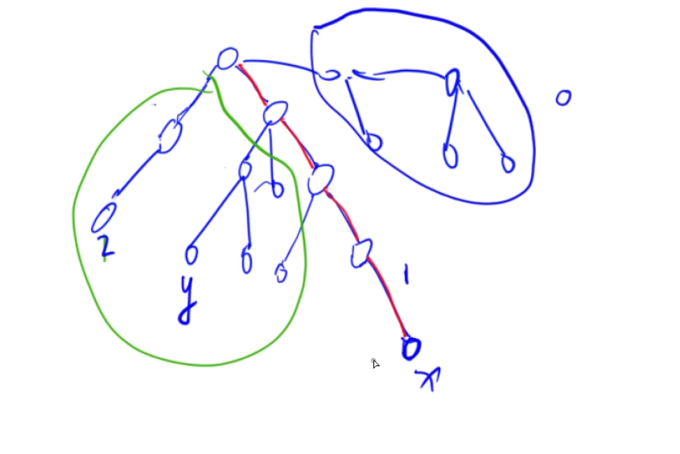

​              

[csdn](https://blog.csdn.net/jeryjeryjery/article/details/52853017?ops_request_misc=%257B%2522request%255Fid%2522%253A%2522167724667516782425164078%2522%252C%2522scm%2522%253A%252220140713.130102334..%2522%257D&request_id=167724667516782425164078&biz_id=0&utm_medium=distribute.pc_search_result.none-task-blog-2~all~top_positive~default-1-52853017-null-null.142^v73^insert_down2,201^v4^add_ask,239^v2^insert_chatgpt&utm_term=LCA&spm=1018.2226.3001.4187)

[Tarjan 离线算法](https://www.cnblogs.com/JVxie/p/4854719.html)

[3](https://www.dreamwings.cn/lca/4874.html)

LCA问题**(least Common Ancestors**,最近公共祖先问题),是指给定一棵有根树T,给出若干个查询LCA(u,v)(通常查询数量较大)，每次求树T中两个顶点u和v的最近公共祖先，即找到一个节点，同时是u和v的祖先，并且深度尽可能的大(尽可能远离树根).

`最近公共祖先的概念`

- 在一棵没有环的树上，每个节点肯定有其父亲节点和祖先节点，而最近公共祖先，就是两个节点在这棵树上**深度最大**的**公共**的**祖先节点**。换句话说，就是两个点在这棵树上**距离最近的公共祖先节点**。

LCA问题的解法有很多，有一般解法，基于tarjan的解法，跳表解法以及RMQ和LCA互相转化的解法。下面我们依次介绍一下:
————————————————

#### **(一):一般解法**

根据树的结构，树中除根节点外的每个节点有且只有一个父节点，所以我们可以记录好每一个节点的父节点，这样我们能够根据父节点的父节点，一次来遍历到每个节点的所有祖先节点(祖先节点就是节点的父节点，节点父节点的父节点，依次类推)。

然后我们要查询两个节点的最近公共祖先，只需要找到两个节点往上找时，第一个相同的祖先。

为每个节点标记好它的父节点只需要维持一个数组_father[n],然后在深度遍历的时候存在来就好。

为了方便找到第一个祖先，我们可以维持一个数组depth[n],因为它俩的祖先一定是深度相同的节点(同一个节点嘛，所以深度肯定相同),所以我们可以先将深度较大的节点u向上查找，找到它的某个祖先s，使得这个s节点的深度和另外一个节点v的深度一样，然后判断s和v是否相等，如果不相等就俩者同时向上查找祖先，这样能够保证俩这的深度一样，直到俩个节点是同一个节点，就说明找到了共同的祖先。
————————————————

3.

Tarjan – 离线求LCA
在线做法：读一个询问，处理一个，输出一个
离线做法：读完全部询问，再全部处理完，再全部输出

在深度优先遍历时，将所有点分成三大类

- 2号点：代表已经访问并结束回溯

- 1号点：代表正在访问

- 0号点：代表还没有访问过

其中所有2号点和正在搜索的1号点路径中已经通过并查集合并成一个集合



 

1、先求出所有点到根结点的距离depth[]，设x号点和y号点的最近公共祖先是p,则x和y的最近距离等于

$depth[x] + depth[y] - 2 * depth[p]$

2、在深度优先遍历1号点中的u点的时候，需要把u的查询的另外一个点的最短距离进行计算并存储，最后把u点合并到上一结点的集合


[链接：](https://www.acwing.com/solution/content/9034/) 
来源：AcWing

2.

>1. 从根节点（root）开始**深搜，**
>
>2. 对于**新搜索到的**一个节点（x），首先**创建由这个结点构成的集合***（由par数组维护，par[x]=x，当前这个集合中只有元素x）*，
>
>3. 然后依次**搜索并处理该节点包含的所有子树***（搜素和处理是个递归的过程。\*结合第5点理解：**每搜索完一棵子树，则可确定子树内的LCA询问都已解，其他的LCA询问的结果必然在这个子树之外。）\*
>    *
>
>4. 当搜索完该节点的所有子树以后，在**回溯时，把当前节点的par[x]=（x的父亲节点）***（集合归并）*
>
>5. 然后
>
>  开始处理原先所有询问中包含了该节点的所有询问
>
>  及求LCA(u,?)
>
>  （体现了**[离线算法](http://alanyume.com/tag/离线算法)**，对**询问次序**按深搜时遍历到的节点顺序进行**重组**）
>
>  - 在处理包含该节点的询问中，先**判断**当前正在处理的这条**询问**(求LCA（u,v）)**中另一个节点（v）是否也已经被遍历过**，
>  - 若**还未遍历，则暂不处理**；**否则LCA（u,v）= FindPar（par[v]）***（并查集）*。*（证明：因为v是在遍历到u（也就是当前的x节点）之前先遍历到了。如果有一个从当前结点（u）到结点v的询问，且v已被检查过，则由于进行的是深度优先搜索，当前结点与v的最近公共祖先一定还没有被检查，而这个最近公共祖先的包涵v的子树一定已经搜索过了，那么这个最近公共祖先一定是v所在集合的祖先。)*
>  - 包含该节点的所有询问全部处理完毕

[4](https://www.cnblogs.com/winter-bamboo/p/10634449.html)

好了，来分析一下这个题目吧，求指定村庄之间的最短距离，因为要用到 Lowest Common Ancestor  算法，我们用dis[x]表示结点（也就是城市x）离根结点的距离，由于题目的特殊性， "But luckily int this village  the answer is always unique, since the roads are built in the way that  there is a unique simple path("simple" means you can't visit a place  twice) between every two houses" ,  这个地方说明了每两个城市之间的路是固定的，有且只有一条（想到这里，发现哪里是什么最短路，就是要你求两点之间的距离）。

   假设u,v为要求距离的两个城市，k表示二者的LCA，那么dis[u] - dis[k] 为u距离LCA的距离，而dis[v] - dis[k] 为v距离LCA的距离，所以$dis[u] + dis[v] - 2 * dis[k]$  就是两个城市之间的距离，然后其他的步骤就按照LCA算法求出LCA就好，LCA的教程请参考上面的哪个网址，个人觉得讲的很好

```cpp
//倍增
#include<iostream>
#include<cstdio>
#include<algorithm>
#include<cstring>
#include<string>
#include <vector>
using namespace std;
const int inf = 0x3f3f3f3f;
const int max2 = 100 + 10;
const int max3 = 1000 + 10;
const int max4 = 10000 + 10;
typedef struct Edge{
	int to;
	int val;
	Edge(int to = 0 , int val = 0):to(to),val(val){}
}Edge;

vector<Edge>road[4 * max4];		
//road[x]保存从x出发的所有道路，road[x][i].to表示这条路的另一个点
int dis[4 * max4];			//dis[x]记录结点x离根结点的距离
int father[4 * max4][15];		//father[x][j]记录从x点向上2^j次层的祖先结点
int depth[4 * max4];			//depth[x]记录点x的深度
int lg[4 * max4];			//log2n 向下取整

void init()
{
	memset(dis, 0, sizeof(dis));
	memset(father, 0, sizeof(father));
	memset(depth, 0, sizeof(depth));
	for (int i = 0; i < 4 * max4;i++)
		road[i].clear();
}

void dfs(int now,int fa)
{
	depth[now] = depth[fa] + 1;
	father[now][0] = fa;

	//将now点的祖先结点全部记录下来
	for (int j = 1; j <= lg[depth[now]] + 1; j++)
		father[now][j] = father[father[now][j - 1]][j - 1];

	//搜索当前结点的子结点
	for (int i = 0; i < road[now].size();i++)
	{
		if(road[now][i].to != fa)			               
            //如果某一条路是当前结点和父结点的，那么没有必要向上搜索
		{
			dis[road[now][i].to] = dis[now] + road[now][i].val;   
            //子结点到根结点的距离等于父结点到根结点的距离加上这条路的距离
			dfs(road[now][i].to, now);
		}
	}
}

//返回结点u,v的最小公共祖先
int lca(int u,int v)
{
	if (depth[u] < depth[v])
		swap(u, v);

	while (depth[u] != depth[v])
		u = father[u][lg[depth[u] - depth[v]]];

	if (u == v)
		return u;

	for (int i = lg[depth[u]];i >= 0;i--)
	{
		//当两者的某祖先结点不一致的时候，说明还需要继续向上查找
		//当u,v位lca的最近子结点的时候，对于任意的father[u][i]都满足
		//father[u][i] == father[v][i] ，所以最后u,v为lca的最近子结点
		if(father[u][i] != father[v][i])
		{
			u = father[u][i];
			v = father[v][i];
		}
	}
	return father[u][0];
}

int main()
{
	//预处理，lg[x]表示log2n向下取整
	lg[0] = -1;
	for (int i = 1; i < 4 * max4;i++)
		lg[i] = lg[i >> 1] + 1;

	int t;
	scanf("%d",&t);
	while(t--)
	{
		init();
		int n, m;
		scanf("%d%d", &n, &m);
		for (int i = 1; i < n; i++)
		{
			int s, e, v;
			scanf("%d%d%d", &s, &e, &v);
			road[s].push_back({ e,v });
			road[e].push_back({ s,v });
		}
		dfs(1, 0);					
        //树中任意一个结点均可以作为根结点，但是不确定结点的个数，而且编号为1的结点所以的树均有，所以将1作为根结点
		while(m--)
		{
			int s, e;
			scanf("%d%d", &s, &e);
			int k = lca(s, e);
			printf("%d\n", dis[s] + dis[e] - 2 * dis[k]);
		}
	}
	return 0;
}
```


lxc

```cpp
#include<bits/stdc++.h>
#define int long long
#define maxn 500010
using namespace std;

int t,n,m;
int u,v,w;
int x,y;

struct EDGE{
	int nxt,to,val;
}e[maxn*2];
int head[maxn],cnt;
int sz[maxn];
int dep[maxn];
int son[maxn];
int top[maxn];
int f[maxn];

inline void add(int u,int v,int w){
	e[++cnt].to=v;
	e[cnt].val=w;
	e[cnt].nxt=head[u];
	head[u]=cnt;
}

inline void dfs1(int u,int fa){
	sz[u]=1; f[u]=fa;
	for(int i=head[u];i;i=e[i].nxt){
		int v=e[i].to;
		if(v==fa) continue;
		dep[v]=dep[u]+e[i].val;//更新节点深度
		dfs1(v,u);
		sz[u]+=sz[v]; 
		if(sz[v]>sz[son[u]]){ //更新重儿子
			son[u]=v;
		}
	}
}

inline void dfs2(int u,int tp){
	top[u]=tp;
	if(son[u]){
		dfs2(son[u],tp);
	}
	for(int i=head[u];i;i=e[i].nxt){
		int v=e[i].to;
		if(v==f[u]||v==son[u]) continue;
		dfs2(v,v);
	}
}

inline int LCA(int x,int y){
	while(top[x]!=top[y]){
		if(dep[top[x]]<dep[top[y]]) swap(x,y);
		x=f[top[x]];
	}
	if(dep[x]<dep[y]) return x;
	else return y;
}

int s;

signed main(){
	ios::sync_with_stdio(0);
	t=1;
	while(t--){
		for(int i=1;i<=n;++i){
			head[i]=sz[i]=dep[i]=son[i]=top[i]=f[i]=0;
		}
		cin>>n>>m>>s;
		for(int i=1;i<n;++i){
			cin>>u>>v;
			w=1;
			add(u,v,w);
			add(v,u,w);
		}
		dfs1(s,0);
		dfs2(s,s);
		for(int i=1;i<=m;++i){
			cin>>x>>y;
			cout<<LCA(x,y)<<endl;
		}
	}
	return 0;
}
```

Tarjan

```cpp
 #include <iostream>
#include <stdio.h>
using namespace std;

#define max_size 40002

int cnt, head[max_size], next[max_size];
int set[max_size], d[max_size], ans[201];
bool fals[max_size];

struct Edge
{
    int v;
    int w;
    int pre;
}eg[2*max_size], ask[404];

int find(int x)
{
    if (x == set[x])
        return x;
    else
        set[x] = set[set[x]];
    return find(set[x]);
}


void add_edge(int x, int y, int z)
{
    eg[cnt].v = y;
    eg[cnt].w = z;
    eg[cnt].pre = head[x];
    head[x] = cnt++;
}

void add_ask(int x, int y, int cast)
{
    ask[cnt].v = y;
    ask[cnt].w = cast;
    ask[cnt].pre = next[x];
    next[x] = cnt++;
}

void Tarjan(int k)
{
    fals[k] = true;

    if (head[k] == 0)return ;

    int i, x, root;

    for (i = next[k]; i != 0; i = ask[i].pre)
    {
        x = ask[i].v;
        if (!fals[x])continue;
        root = find(x);
        ans[ask[i].w] = d[x] + d[k] - 2*d[root];
    }

    for (i = head[k]; i != 0; i = eg[i].pre)
    {
        x = eg[i].v;
        if (fals[x])continue;
        d[x] = d[k] + eg[i].w;
        Tarjan(x);
        x = find(x);
        set[x] = k;
    }

}

int main()
{
    int i, m, n;
    int x, y, z;
    int t;
    cin >> t;
    while (t--)
    {
        cin >> n >> m;
        for (i = 0; i <= n; i++)
        {
            head[i] = next[i] = 0;
            set[i] = i;
            fals[i] = false;
        }
        
        cnt = 1;
        for (i = 1; i < n; i++)
        {
            scanf("%d%d%d", &x, &y, &z);
            add_edge(x, y, z);
            add_edge(y, x, z);
        }
        cnt = 1;
        for (i = 1; i <= m; i++)
        {
            scanf("%d%d", &x, &y);
            add_ask(x, y, i);
            add_ask(y, x, i);
        }
        d[1] = 0;
        Tarjan(1);

        for (i = 1; i <= m; i++)
            printf("%d\n", ans[i]);
    }
    return 0;
}


```


zhy


```cpp
#include<iostream>

using namespace std;
typedef long long ll;
typedef unsigned long long ull;
#define rep(i,a,n) for(int i=a;i<n;i++)
#define per(i,a,n) for(int i=n-1;i>=a;i--)
#define fastio ios::sync_with_stdio(false);cin.tie(0);cout.tie(0);
#define multi int _;cin>>_;while(_--)
ll gcd(ll a,ll b){ return b?gcd(b,a%b):a;}
const ll MOD = 998244353;
//const ll MOD = 1e9+7;
const ll N = 200005;
//head

int pre[N], idx = 0, hx[N];
int a[N];
int head[N], nxt[N], to[N], id = 0;
int sz[N];

void add(int x, int y)
{
    nxt[++id] = head[x];
    head[x] = id;
    to[id] = y;
}


void dfs(int x, int fx)
{
    pre[++idx] = x;
    for(int i = head[x] ; i ; i = nxt[i])
    {
        int y = to[i];
        if(y == fx) continue;
        dfs(y, x);
        sz[x] += sz[y];
    }
}
int c[N];

int lowbit(int x)
{
    return x & (-x);
}

void change(int x, int y)
{
    for(; x < N ; x += lowbit(x))
    {
        c[x] += y;
    }
}

int query(int x)
{
    int ans = 0;
    for(; x; x -= lowbit(x))
    {
        ans += c[x];
    }
    return ans;
}


int main()
{  
    fastio
    //freopen("1.in","r",stdin);
    int n;
    cin >> n;
    fill(sz + 1, sz + n + 1, 1);
    fill(a + 1, a + n + 1, 1);

    for(int i = 1 ; i < n ; i++ )
    {
        int x, y;
        cin >> x >> y;
        add(x, y);
        add(y, x);
    }
    dfs(1, 0);
    for(int i = 1 ; i <= n ; i++ )
    {
        hx[pre[i]] = i + 1; 
    }
    int m;
    cin >> m;
    /*for(int i = 1 ; i <= n ; i++ )
    {
        cout << pre[i] << " \n"[i == n];
    }*/
    for(int i = 1 ; i <= n ; i++ )
    {
        change(i+1, 1);
    }
    for(int i = 1 ; i <= m ; i++ )
    {
        char op;
        int x;
        cin >> op >> x;
        if(op == 'C')
        {
            if(a[x] == 1)
            {
                change(hx[x], -1);
                a[x] = 0;
            }else{
                change(hx[x], 1);
                a[x] = 1;
            }
        }else{
            cout << query(hx[x] + sz[x] - 1) - query(hx[x] - 1) << "\n";
        }
    }
    return 0;
}
```


