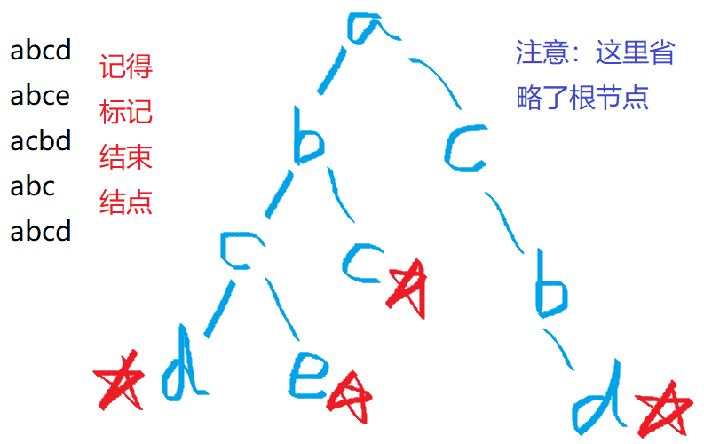
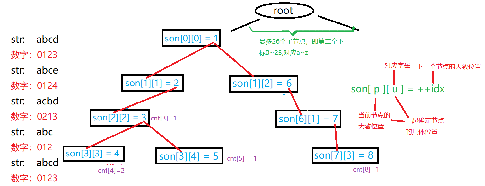

### [一Trie树](https://blog.csdn.net/qq_49688477/article/details/118879270?ops_request_misc=%257B%2522request%255Fid%2522%253A%2522168018237216800188578645%2522%252C%2522scm%2522%253A%252220140713.130102334..%2522%257D&request_id=168018237216800188578645&biz_id=0&utm_medium=distribute.pc_search_result.none-task-blog-2~all~top_positive~default-1-118879270-null-null.142^v80^control,201^v4^add_ask,239^v2^insert_chatgpt&utm_term=%E5%AD%97%E5%85%B8%E6%A0%91&spm=1018.2226.3001.4187)

**Trie树**又称字典树、单词查找树。是一种能够高效存储和查找字符串集合的数据结构。 

Trie 树，是一种树形结构。典型应用是用于统计和排序大量的字符串前缀来减少查询时间，最大限度地减少无谓的字符串比较。

Trie 树的核心思想是空间换时间。利用字符串的公共前缀来降低查询时间的开销以达到提高效率的目的。

Trie树本质上是一颗多叉树，对于字母而言最多有26个子结点。所以这个数组包含了两条信息。比如：$son[1][0]=2$表示1结点的一个值为a的子结点为结点2;如果$son[1][0] = 0$，则意味着没有值为a子结点。这里的$son[N$][26]相当于链表中的$ne[N]$.​

### **二.字典树的性质**

1.根节点不包含字符，除根节点外每一个节点都只包含一个字符。

2.从根节点到某一节点，路径上经过的字符连接起来，为该节点对应的字符串。

3.每个节点的所有子节点包含的字符都不相同。


### 三.字典树的操作

**1.映射字符**

```cpp
int getnum(char x){
    if(x>='A'&&x<='Z')
        return x-'A';
    else if(x>='a'&&x<='z')
        return x-'a'+26;
    else
        return x-'0'+52;
} 
```

**2.插入字符串**

```c++
void insert(char str[])
{
    int p=0,len=strlen(str);
    for(int i=0;i<len;i++)
    {
        int c=getnum(str[i]);
        if(!t[p][c])
            t[p][c]=++idx;
        p=t[p][c];
        cnt[p]++;
    }
}
```

**3.查询操作**

```cpp
int find(char str[])
{
    int p=0,len=strlen(str);
    for(int i=0;i<len;i++)
    {
        int c=getnum(str[i]);
        if(!t[p][c])
            return 0;
        p=t[p][c];
    }
    return cnt[p];
}
```

**4.main 函数部分**

```cpp
int main(){
    scanf("%d",&T);
    while(T--)
    {
        for(int i=0;i<=idx;i++)
            for(int j=0;j<=122;j++)
                t[i][j]=0;
        for(int i=0;i<=idx;i++)
            cnt[i]=0;
        idx=0;
        scanf("%d%d",&n,&q);
        for(int i=1;i<=n;i++)
        {
            scanf("%s",s);
            insert(s);
        }
        for(int i=1;i<=q;i++)
        {
            scanf("%s",s);
            printf("%d\n",find(s));
        }
    }
    return 0;
}
```

这里我们用到了几个变量，这里分别一一解释
1.变量`id`： id代表字典树中每一个节点的编号，id的大小只与插入字典树的先后顺序有关，它的作用在下面会讲到。

2.`trie[N][26]`： 每个trie代表一条边，字典树其中1-N为边上方节点的编号，0代表root节点，1~26为连在i节点下方的26个字母。如果`trie[i][x]=0`,则代表字典树中目前没有这个点，而`trie[i][x]`的值代表这个点下方连有的点的编号，例如：`trie[i][2]=9`代表第i号点和的下方连有一个点‘c’，并且那个点的编号是9，为什么是c呢？因为 `‘c’-‘a’=2`

3.`cnt[N]`: `cnt[i]==0`代表编号为i的点不是一个单词的结束点，在上面的图中代表这个点不是空点，但是没有标红，`cnt[i]！=0`代表编号为i的点是一个单词的结束点，即红点。cnt[i]不一定只为0或1，因为有可能多次输入了同一个单词。

4.（难点）两个函数中的变量p:
p代表查询与插入时的不断变化的当前节点编号，初始化为0，代表初始节点，在函数的循环中，我们首先用x确定接下来要找的字母，再通过变量x确定了接下来我们需要查找当前节点下是否有连接着目标字母的节点。通过每次确定的x，我们通过`trie[p][x] `查找连着目标字母的节点的编号，如果目标节点存在，就把p更新成目标节点的编号（`p = trie[p][x]`）。而如果`trie[p][x] == 0`，代表字典树中没有这个点，如果是查找就代表没有这个单词，查找失败。而如果是插入函数，我们就用 ++id 来把这个点存进字典树。我们在两个函数的最后用cnt[p]来涂红节点或返回节点值。


完整版

```cpp
#include<bits/stdc++.h>
using namespace std;
#define maxn 1010
const int N=3e6+10; 
int tt,q,n,t[N][65],cnt[N],idx;
//cnt[]存储以某节点结尾的字符串个数（同时也起标记作用）
//idx表示当前要插入的节点是第几个,每创建一个节点值+1
char s[N];
int getsum(char x){  //直接写成 return x-'a'; 是不是一样的？ 
	if(x>='A'&&x<='Z'){
		return x-'A';
	}else if(x>='a'&&x<='z'){
		return x-'a'+26;
	}else{
		return x-'0'+52;
	}
}
void insert(char str[]){
	int p=0,len=strlen(str);
	for(int i=0;i<len;i++){
		int c=getsum(str[i]);
		if(!t[p][c]){
			t[p][c]=++idx;
		}
		p=t[p][c];
		cnt[p]++;
	}
}
int find(char str[]){
	int p=0; //类似指针，指向当前节点
	int len=strlen(str);
	for(int i=0;i<len;i++){
		int c=getsum(str[i]);
		if(!t[p][c]){ //该节点不存在，创建节点
			return 0;
		} 
		
		p=t[p][c]; //使“p指针”指向下一个节点
	}
	return cnt[p];//结束时的标记，也是记录以此节点结束的字符串个数
}
int main(){
	cin>>tt;
	while(tt--){
		for(int i=0;i<=idx;i++){
			for(int j=0;j<=122;j++){ //122 ??
				t[i][j]=0;
			}
		}
		for(int i=0;i<=idx;i++){
			cnt[i]=0;
		}
		idx=0;
		cin>>n>>q;
		for(int i=1;i<=n;i++){
			cin>>s;
			insert(s);
		}
		for(int i=1;i<=q;i++){
			cin>>s;
			cout<<find(s)<<endl;;
		}
	} 
	return 0;
} 
```


https://www.acwing.com/problem/content/837/





```cpp
//Trie树快速存储字符集合和快速查询字符集合
#include <iostream>

using namespace std;

const int N = 100010;
//son[][]存储子节点的位置，分支最多26条；
//cnt[]存储以某节点结尾的字符串个数（同时也起标记作用）
//idx表示当前要插入的节点是第几个,每创建一个节点值+1
int son[N][26], cnt[N], idx;
char str[N];

void insert(char *str)
{
    int p = 0;  //类似指针，指向当前节点
    for(int i = 0; str[i]; i++)
    {
        int u = str[i] - 'a'; //将字母转化为数字
        if(!son[p][u]) son[p][u] = ++idx;   //该节点不存在，创建节点
        p = son[p][u];  //使“p指针”指向下一个节点
    }
    cnt[p]++;  //结束时的标记，也是记录以此节点结束的字符串个数
}

int query(char *str)
{
    int p = 0;
    for(int i = 0; str[i]; i++)
    {
        int u = str[i] - 'a';
        if(!son[p][u]) return 0;  //该节点不存在，即该字符串不存在
        p = son[p][u]; 
    }
    return cnt[p];  //返回字符串出现的次数
}

int main()
{
    int m;
    cin >> m;

    while(m--)
    {
        char op[2];
        scanf("%s%s", op, str);

        if(*op == 'I') insert(str);
        else printf("%d\n", query(str));
    }

    return 0;
}
```