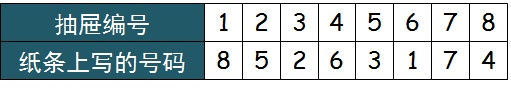

# #P1018. 百囚犯问题

### 题目描述

`Philippe Flajolet`和`Robert Sedgewick`在20092009年提出了“百囚犯问题（100 prisoners problem）”：

在某个法制不健全的国家， 监狱中有编号1到100的100名死刑犯。监狱长给了他们最后一次机会：

一个房间里有100个100个抽屉，监狱长随意地把1到100这100个号码放入1号到100号抽屉中，每个抽屉一张。囚犯们逐个进入房间，每人可以任意打开50个抽屉，之后关上。如果每名囚犯都在这50个抽屉中发现了他的号码，那么**所有的犯人都会被赦免；如果有人没有找到他的号码，那么所有的囚犯都会被处死**。在第一个囚犯进入房间之前，囚犯们允许一起讨论开抽屉的“策略”，但一旦第一个囚犯进入房间，他们之间就被禁止交流。

在某一个平行宇宙中，这100个囚犯都是绝顶聪明的人，他们很快就想到了**最佳的策略**，想必聪明的你一定也想到了。为了让监狱长更快的知道这些囚犯的结果，请你在监狱长放完这些号码后告诉他。

### 输入格式

输入一行为一个整数T*T*，表示有T*T*组测试（1<=T<=1001<=*T*<=100）。

每组包含100100个数，代表从11到100100号抽屉中的号码（题目保证号码不会重复）。

### 输出格式

对于每组输入，输出一行，若囚犯会被赦免就输出`YES`，否则输出`N0`。

### 样例输入1

```none
2
1 2 3 4 5 6 7 8 9 10 11 12 13 14 15 16 17 18 19 20 21 22 23 24 25 26 27 28 29 30 31 32 33 34 35 36 37 38 39 40 41 42 43 44 45 46 47 48 49 50 51 52 53 54 55 56 57 58 59 60 61 62 63 64 65 66 67 68 69 70 71 72 73 74 75 76 77 78 79 80 81 82 83 84 85 86 87 88 89 90 91 92 93 94 95 96 97 98 99 100
2 3 4 5 6 7 8 9 10 11 12 13 14 15 16 17 18 19 20 21 22 23 24 25 26 27 28 29 30 31 32 33 34 35 36 37 38 39 40 41 42 43 44 45 46 47 48 49 50 51 52 53 54 55 56 57 58 59 60 61 62 63 64 65 66 67 68 69 70 71 72 73 74 75 76 77 78 79 80 81 82 83 84 85 86 87 88 89 90 91 92 93 94 95 96 97 98 99 100 1

```

[Copy](javascript:;)

### 样例输出1

```none
YES
N0//注意！！这里是0，不是O！！
//输出格式最好是复制样例的输出
```


### KEY

==最佳策略==

>1. 每个囚犯首先打开与自己号码对应的抽屉；
>2. 如果该抽屉里的号码牌是此囚犯的号码，则该囚犯挑战成功；
>3. 否则该抽屉中存放的是另一个囚犯对应的号码牌，接着用该号码牌对应的抽屉；
>4. 每名囚犯重复2和3的步骤，直到找到自己的号码牌或者打开了50个抽屉为止。

>**示例1：**
>
>考虑一个迷你版的，把100改成8，50改成4，抽屉放纸条的方式按如下所示：
>
>
>
>策略的具体实现如下：
>
>- 1号囚犯打开1号抽屉发现8号纸条、打开8号抽屉发现4号纸条、打开4号抽屉发现6号纸条、打开6号抽屉发现1号纸条-----命悬一线有惊无险
>  2号囚犯开2号-->开5号-->开3号-----找到
>   3号囚犯开3号-->开2号-->开5号-----找到
>   4号囚犯开4号-->开6号-->开1号-->开8号-----找到
>   5号囚犯开5号-->开3号-->开2号-----找到
>   6号囚犯开6号-->开1号-->开8号-->开4号-----找到
>   7号囚犯开7号-----找到
>   8号囚犯开8号-->开4号-->开6号-->开1号-----找到
>
>
>  大家都被赦免了！
>
>**示例2：**
>
>抽屉放纸条的方式如下：
>
>
>
>策略的具体实现如下：
>
>第一个进去的囚犯开1号-->开5号-->开8号-->开2号----不是，，，( ¯ □ ¯ )……(x___x) 
>
>

==分析==

- 抽屉的编号和抽屉里的数字形成置换，根据定理任意置换可唯一的表示成若干不相交轮换的复合（积）.

  于是示例1中的置换可写成：(1,8,4,6)(2,5,3)(7),

  ​		示例2中的置换可写成：(1,5,8,2,7)(3,4,6)

  于是容易得出结论：如果 i 所在的轮换长度不超过50，那么第 i 号囚犯一定可以找到自己的号码纸条；如果 i 所在的轮换长度超过50，那么第 i 号囚犯一定找不到自己的号码纸条。

- 标注

  1、其实按照这个策略，当前50个囚犯成功时，后50已经不必再试就知道他们必然获释

  2、在前50个人中如果有人是第50个抽屉才发现自己的号码，那么后面的囚犯都不必再试

 ==**最优策略下的成功概率**==

>实质就是在 100! 种(n种元素的置换有n!种)中，有多少置换存在长度大于50的轮换？
>
>易知任意一个置换分解后至多存在一个长度大于50的置换.
>
>我们假定置换下面假定置换 pi，其长度为 l.
>
>　　------轮换sigma中的元素有C(100,l)种可能
>
>　　-------选定l个元素后，可以形成(l - 1)!种不同的轮换（即圆排列数）
>
>　　-------剩下的(100 - l)个元素可形成(100 - l)!种置换
>
>　　-------于是这样的置换一共有C(100,l) * (l - 1) * (100 - l) = 100! / l种
>
> 所以成功的概率是1 - 0.6882 = 0.3118.
>
>

### ac-code

#### c++

~~~c++
#include<bits/stdc++.h>
using namespace std;
#define MAXN 100100
#define ll long long int
/**
 * p1018 百囚犯问题
*/
int n,flag;

bool judge(int arr[],int people);
int main(){
      cin>>n;
      int ans[n+1];
      int a[n+1][105];
      for(int i=1;i<=n;i++){
        for(int j=1;j<=100;j++){
            cin>>a[i][j];
        }
      }
      flag=0;
      for(int i=1;i<=n;i++){//第i个测试
        	flag=1;		//用于判断第i次判断是否成功
        for(int j=1;j<=100;j++){	//第j个人
            if(!judge(a[i],j)){		//找不到自己编号的情况
                ans[i]=0;
                flag=0;
                break;
            }

        }
        if(flag==0){
            ans[i]=0;
        }else{
            ans[i]=1;
        }

      }
      for (int i = 1; i <= n; i++) {
            if (ans[i]==1){
                 cout<<"YES"<<endl;
            }else {
                 cout<<"N0"<<endl;
            }
        }

} 
bool judge(int arr[],int people){	//轮换
    int i=1;
    int a=people;
    do{
        if(arr[people]==a){
            return true;
        }else{
            people=arr[people];
            i++;
        }
    }while(i<=50);
    return false;
}
~~~


#### java

~~~java
import java.util.Scanner;

public class P1018_1 {
    public static void main(String[] args) {
        int n = 0;
        Scanner  scanner = new Scanner(System.in);
        n = scanner.nextInt();
        int[] ans = new int[n+1];
        int[][] a = new int[n+1][105];
        for (int i = 1; i <= n; i++) {
            for (int j = 1; j <= 100; j++) {
                a[i][j] = scanner.nextInt();
            }
        }
        int flag = 0;
        for (int i = 1; i <=n; i++) {//第i个测试
            flag = 1;//用于判断第i次测试是否成功
            for (int j = 1; j <= 100; j++) {//第j个人
                if (!judge(a[i],j)){
                    ans[i] =0;
                    flag = 0;
                    break;
                }
            }
            if (flag==0){
                ans[i] = 0;
            }else {
                ans[i] = 1;
            }
        }
        for (int i = 1; i <= n; i++) {
            if (ans[i]==1){
                System.out.println("YES");
            }else {
                System.out.println("N0");
            }
        }

    }
    public static boolean judge(int[] arr,int people){
        int i =1 ;
        int a = people;
        do {
            if (arr[people] == a){
                return true;
            }else{
                people = arr[people];
                i++;
            }
        }while (i<=50);
        return false;
    }
}

~~~

